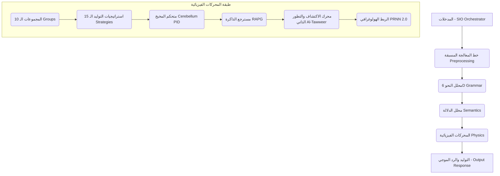

# معمارية نموذج مِرنان V9 (Julia)

## نظرة عامة
مرنان V9 هو نظام لغوي فيزيائي ديناميكي يعتمد بالكامل على قوانين الفيزياء الكلاسيكية والكمية وميكانيكا الأمواج لتمثيل وفهم وتوليد النصوص باللغتين العربية والإنجليزية. لا يستخدم النموذج أي شبكات عصبية، أو تعلم تقليدي (Backpropagation)، بل يعتمد على محاكاة الرنين الموجي والجاذبية في فضاء الطور الكثيف، والتحسين التطوري الجيني الذاتي.

---

## المكونات الرئيسية للمشروع

تترتب معمارية مرنان V9 في 5 طبقات رئيسية متناسقة كالتالي:



---

## تفصيل المحركات والتحسينات في الإصدار V9 (المراحل الـ 8 المكتملة)

### 1. تثبيت المسار الساخن على Float32 (Memory & Performance)
لتحسين أداء المعالجة وتقليص استهلاك الذاكرة العشوائية بنسبة 50%:
* تم تعديل متجهات الكلمات الكبيرة (10,000 بُعد) وقنوات التخزين المؤقت `pv_cache` و `syntax_cache` لتعمل بنوع `Vector{Float32}` بدلاً من `Float64`.
* تم الاحتفاظ بنوع `Float64` للثوابت الفيزيائية الدقيقة وحسابات الكتل والتسجيل النهائي لضمان عدم حدوث تشويه أو تراكم خطأ في الدقة.

### 2. التخزين المؤقت المستمر والتخريط بالذاكرة (Persistent Cache & Mmap)
لمنع تأخير التشغيل البدئي (الذي كان يستغرق 14 دقيقة لحساب متجهات 532K كلمة):
* يتم تخزين متجهات الطور والكتل بعد أول تشغيل في ملفات ثنائية صلبة: `pv_cache.bin` و `mass_cache.bin` في مجلد `model/`.
* يتم ربط هذه الملفات مباشرة بالذاكرة الافتراضية عبر `Mmap.mmap` في زمن أقل من 1 ثانية وبأداء قراءة فوري O(1) عند الحاجة.
* تم ضبط الرأس الثنائي ليكون محاذياً على حدود 8 بايت (`Int64 Header` لـ `mass_cache`) لمنع أخطاء المحاذاة.

### 3. استراتيجيات التوليد الـ 15 (Strategy Pattern)
يعتمد المولد على **نمط الاستراتيجيات** لتوزيع المسؤوليات وسهولة الصيانة:
* `shared_scoring.jl`: يحتوي على عوامل التسجيل الفيزيائي الموحد.
* `resonant_strategy.jl`: استراتيجية الرنين والبحث الشعاعي العام.
* `dialogue_strategy.jl`: استراتيجية إدارة الحوار والرد المباشر.
* `yesno_relations.jl`: صياغة إجابات الأسئلة التأكيدية.
* `evidence_relations.jl`: الاستدلال المنطقي وتقديم البينات المعرفية.
* `definition_strategy.jl`: شرح المفاهيم والتعريفات المصطلحية.
* `code_strategy.jl` & `math_strategy.jl`: البرمجة الفيزيائية وحل المسائل الرياضية.
* `nisba_relations.jl`: حساب النِسب اللغوية والاشتقاق الدلالي.

### 4. التخميد وقص المطال في مذبذبات كوراموتو (Kuramoto Damping & Clipping)
لمنع انفجار الموجات أو التشتت اللانهائي أثناء المحاكاة الزمنية:
* تم دمج معامل التخميد الديناميكي (`damping_coeff::Float64 = 0.1`) في محاكاة المذبذبات.
* تم إصلاح قوة الجاذبية لترتبط بالكلمات الفعلية في السياق بدلاً من رموز الحروف الثابتة.
* تم تطبيق حد أقصى لتحديثات الزوايا (Amplitude Clipping) لمنع تشتت تكامل Runge-Kutta 4 (RK4).

### 5. متحكم المخيخ التكيفي (Cerebellum PID Feedback)
متحكم مغلق الحلقة يتولى تعديل أوزان التسجيل الـ 24 ديناميكياً أثناء كتابة الكلمة:
* **الهيكل**: متحكم PID كامل يدعم معاملات التناسب والتكامل والتفاضل (`Kp`, `Ki`, `Kd`).
* **منع التراكم (Anti-Windup)**: تقييد التكامل بين `[-10.0, 10.0]` لتجنب التراكم المفرط للأخطاء.
* **إشارة الجودة**: تعتمد على معامل بوابة الإنتروبيا الثرموديناميكية (`entropy_gate`) كمؤشر لاستقرار المعنى اللغوي.
* **التصحيح**: يقوم بضرب الوزن كالتالي: `weights[key] * (1 + 0.1 * output)` لتعزيز العوامل الإيجابية وإضعاف العوامل المشتتة.

### 6. محرك الاكتشاف الذاتي للمفاتيح (Marker Discovery Engine - Phase 6)
نظام تعلم غير خاضع للإشراف لاستكشاف القواعد اللغوية الهيكلية ذاتياً:
* **حساب إنتروبيا السياق (Shannon Context Entropy)** لكل كلمة في الكوربس لتحديد العلامات الأكثر تأثيراً على البنية اللغوية:
  \[H_{avg} = \frac{H_{left} + H_{right}}{2} \ge 0.8\]
* **التصنيف التلقائي** للعلامات المكتشفة إلى 4 أصناف وظيفية: الاستفهام (`question`)، السببية (`causal`)، النفي (`negation`)، والروابط الجملية (`connector`) دون قواعد صلبة مكتوبة مسبقاً.

### 7. حلقة التكامل الشامل للتحكم والمراقبة (Multi-Engine Integration Loop - Phase 7)
بناء حلقة مغلقة ومترابطة بين جميع محركات الذكاء والفيزياء اللغوية:
* **توجيه الاسترجاع المصفى**: استخدام الفهم اللغوي الهيكلي للمفتاح لتوجيه الاسترجاع من مصادر محددة في قاعدة البيانات (مثل توجيه الاستفهام لـ `al_ta3rif` والسببية لـ `al_istinbat`).
* **الضبط الموجه للأوزان**: قيام المخيخ بضبط وزن المعرفة `kb_knowledge` ديناميكياً بناءً على دقة تشابه الاسترجاع الطوري للـ RAPG، وضبط وزن التوجيه العقلي `aql_guidance` استناداً إلى نشاط علامات الاستفهام والسببية المكتشفة.
* **التشخيص الفوري (`integration_log`)**: تتبع كامل للقرارات الفيزيائية للأوزان والكلمات والعلامات النشطة عند كل خطوة توليد.

### 8. الاستقلالية الكاملة والمُحسِّن التطوري (Pure Self-Discovery & Al-Tawweer - Phase 8)
تحقيق الاستقلالية المطلقة لنموذج مِرنان وتحسينه ذاتياً على الكوربس:
* **حذف القوائم الصلبة**: الاستغناء الكامل عن القاموس الثابت `ISTINBAT_MARKERS` في الاستنباط، والاعتماد بنسبة 100% على العلامات المكتشفة تلقائياً عبر محرك الاكتشاف.
* **المُحسِّن التطوري (Al-Tawweer)**: خوارزمية جينية متكاملة (كروموسومات الأوزان، الانتخاب بالبطولة، التزاوج بالخلط الحسابي، الطفرات الغاوسية) لتطوير وتحسين أوزان التقييم الـ 24 للمولد ديناميكياً.
* **تحديث الإعدادات الآمن**: تصدير الأوزان الفائزة وحفظها مباشرة داخل `config.yaml` مع المحافظة على التنسيق والتعليقات والمسافات الفاصلة للملف.

### 9. التوليد الرنيني الكثيف والربط الهولوغرافي (PRNN 2.0 & Holographic Binding - Phase 9)
تطوير ونمذجة استراتيجية التوليد الرنينية الطورية لتوليد نصوص إبداعية وعالية التماسك:
* **استراتيجية التوليد PRNN 2.0**: دمج الشبكة العصبية الرنينية الطورية (`PRNNStrategy`) كأحد استراتيجيات التوليد الفعالة داخل المولد.
* **محاكاة ستوارت-لانداو غير الخطية**: نمذجة التطور الزمني للمذبذبات تحت إشراف معادلات ستوارت-لانداو غير الخطية مع التخميد، التعب العصبي الموضعي، وضوضاء لانجفان الحرارية لكسر الجاذبات المتكررة وضمان تنوع التوليد.
* **الربط وفك الربط الهولوغرافي (Holographic Binding/Unbinding)**: تجميع متجهات الطور للكلمات البذرية عبر جداء الربط الموتر الهولوغرافي (`bind_phase`) وفك تشفير الكلمة الفائزة التالية (`unbind_phase`) باستخدام المرافقة المعقدة (Complex Conjugate) لمعجم الطور.

### 10. التنسيق التوليفي الشامل (SIO - Synthetic Intelligence Orchestrator)
دمج وتنسيق الذكاء التوليفي لحل المسائل اللغوية والرياضية والبرمجية المعقدة:
* **منسق المهام SIO**: يقوم المنسق بتحليل الأمر وتقسيمه ديناميكياً إلى مراحل محددة (نصية، رياضية، برمجية) عبر `GoalParser` و `PhasePlanner`.
* **محرك البرمجة والرياضيات**:
  * إعادة تدوير محركات المولد الأساسي (`gen.code_engine`, `gen.code_phase`, `gen.symbolic_math`) داخل منفذ المراحل `PhaseExecutor` لضمان قراءة القواميس الكودية ومصفوفات `K_code` الحقيقية بدلاً من تهيئة محركات فارغة.
  * تعديل تواقيع الدوال اللغوية والبرمجية لتقبل الأنواع المجردة `AbstractString` لحل مشكلات التوافق مع السلاسل الفرعية `SubString` دون حدوث أخطاء `MethodError` أثناء المعالجة اللغوية.

---

## تدفق البيانات التفصيلي

```
نص السؤال/الأمر (Prompt)
         │
         ▼
[Preprocessing] (إزالة تشكيل، تنظيف، تقطيع)
         │
         ▼
[Context Setup] (امتصاص حقل الأمر PPM)
         │
         ▼
[Cerebellum Policy Selection] (تحديد نمط التوليد والتهيئات)
         │
         ▼
حلقة التوليد (بحد أقصى max_words):
  1. استرجاع المقاطع الفيزيائية من RAPG مصفاة بنشاط المفاتيح المكتشفة ذاتياً.
  2. انتقاء المرشحين الأقوى من K_sem.
  3. تقييم المرشحين بـ 24 عاملاً فيزيائياً موحداً (shared_scoring).
  4. تعديل الأوزان ديناميكياً عبر المخيخ PID بناءً على استقرار إنتروبيا الموجة.
  5. تعديل أوزان kb_knowledge و aql_guidance الموجهة بناءً على جودة الاسترجاع ونشاط المفاتيح.
  6. اختيار الكلمة الفائزة وإضافتها للسياق وتسجيل الخطوة في integration_log.
         │
         ▼
[SelfReview & Learning Loop] (المراجعة وتحديث ثقة المفاتيح المستعملة ديناميكياً)
         │
         ▼
النص المولد النهائي (Final Response)
```
