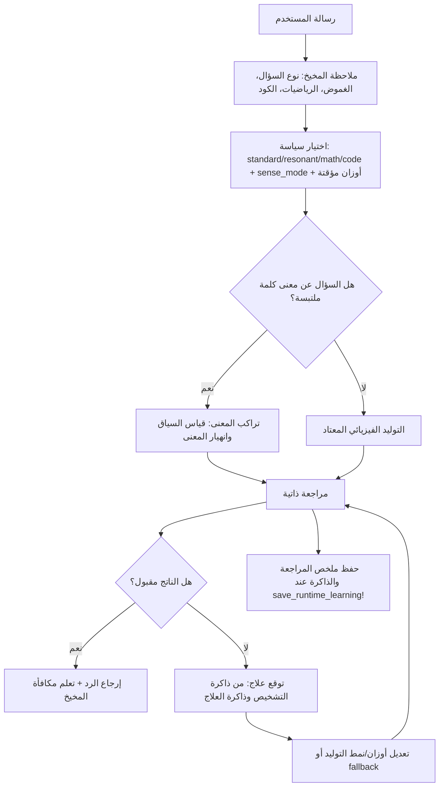

# المخيخ والمراجعة الذاتية وتراكب المعنى في مرنان

تاريخ آخر تحديث: 2026-06-16

صاحب أفكار مرنان: باسل يحيى عبدالله (basil Yahya Abdullah)

هذه الوثيقة تسجل الطبقة الجديدة التي أضيفت حول مولد مرنان: طبقة توجيه خفيفة تشبه
المخيخ، وطبقة تراكب معاني للكلمة الواحدة، وطبقة مراجعة ذاتية تفحص الناتج قبل
اعتماده، ثم ذاكرة تشخيص وعلاج تتعلم من محاولات الإصلاح.

الفكرة المركزية: مرنان لا يحتاج إلى نموذج لغوي كبير صغير يقود نموذجا لغويا أكبر.
هو يحتاج إلى جهاز داخلي محدود وواضح، يرى حالة السؤال، يوجه المحركات، يفحص الناتج،
ثم يتعلم أي علاج أصلح أي خلل. هذا أقرب إلى معالج تحكم أو مخيخ صغير داخل النظام
منه إلى عقل لغوي مستقل.

## الخلاصة

أضيفت أربعة مسارات متكاملة:

| المسار | الملف | الدور |
| --- | --- | --- |
| المخيخ الداخلي | `src/physics/engines/mirnan_cerebellum.jl` | يراقب السؤال ويختار نمط التوليد وتعديلات الأوزان، ثم يتعلم من جودة النتيجة |
| تراكب المعنى | `src/physics/engines/sense_superposition.jl` | يعامل الكلمة متعددة المعنى كحالة احتمالات، ثم ينهار المعنى بالسياق |
| منطق بيان المحلي | `src/physics/engines/bayan_logic_kernel.jl` | نواة تدقيق منطقية صغيرة مستوحاة من بيان لاكتشاف تناقضات بسيطة |
| المراجعة الذاتية | `src/physics/engines/self_review.jl` | تفحص اللغة والمنطق والاتساق والتكرار والالتزام بالسؤال، وتقترح إصلاحا |

ثم وصل `generator.jl` هذه المسارات بدورة التوليد، بحيث لا يكون الناتج آخر خطوة،
بل يدخل في مراجعة، وربما يعاد توجيهه أو إصلاحه قبل إرجاعه.

## دورة التشغيل الجديدة



## المخيخ الداخلي

`MirnanCerebellum` ليس مولدا لغويا. هو متحكم صغير:

- يقرأ prompt أو قائمة tokens.
- يقدر هل السؤال رياضي، برمجي، حواري، إبداعي، أو يحتوي كلمة ملتبسة.
- يختار سياسة تشغيل `CerebellumPolicy`.
- يعدل أوزان `DEFAULT_WEIGHTS` مؤقتا عبر `apply_cerebellum_policy!`.
- يتعلم من النتيجة عبر `learn_from_outcome!`.

أهم الواجهات:

```julia
cb = MirnanCerebellum()
obs = observe_prompt(cb, "ما معنى عين في هذا السياق")
policy = choose_policy!(cb, obs)
apply_cerebellum_policy!(weights, policy)
learn_from_outcome!(cb, obs, policy, output)
```

دور المخيخ هنا أن يحسن اختيار الطريق قبل التوليد. فهو لا يحل محل المحركات
الفيزيائية، بل يضبطها كما يضبط المخيخ الحركة دون أن يكون هو الإنسان كله.

## تراكب المعنى

الكلمة الواحدة قد تحمل أكثر من معنى. في مرنان صارت هذه الفكرة ممثلة صراحة:

```text
عين = نبع ماء + عضو البصر + جاسوس + جوهر الشيء ...
```

قبل السياق تبقى المعاني في حالة تراكب. عند ورود سياق مثل:

```text
شرب المسافر من عين الماء
```

يرتفع احتمال معنى النبع. وعند سياق مثل:

```text
رأى بعينه الطريق
```

يرتفع معنى البصر. وعند:

```text
أرسل الملك عينا بين القوم
```

يرتفع معنى الجاسوس.

الواجهة الأساسية:

```julia
measurement = measure_senses("عين", ["شرب", "المسافر", "الماء"])
top_sense(measurement)
explain_measurement(measurement)
```

تقرير القياس يحتوي احتمالات، وثقة، وهل انهار المعنى إلى اختيار واضح أم بقي
مختلطا. هذا يجعل فكرة "الكلمة كموجة معنى" قابلة للاختبار داخل الكود، لا مجرد
صورة بلاغية.

## منطق بيان المحلي

مرنان لا يعتمد الآن على مجلد `BayanLanguage` بوصفه جزءا من مسار التشغيل. لكن
أخذنا فكرة نافعة منه: التدقيق المنطقي الصغير.

`BayanLogicKernel` يستخرج ادعاءات بسيطة من النص، مثل:

```text
the sun is hot
the sun is not hot
```

ثم يميز التناقض المباشر بين إثبات ونفي لنفس العلاقة. هذا ليس بديلا عن `al_aql`
ولا عن لغة بيان كاملة، لكنه صمام مبكر داخل المراجعة الذاتية.

أهم الواجهات:

```julia
kernel = BayanLogicKernel()
audit = audit_bayan_logic(kernel, "the sun is hot", "the sun is not hot.")
bayan_logic_summary(kernel)
```

بهذا يحتفظ مرنان بفائدة منطق بيان دون أن يربط نفسه بالنسخة الكاملة التي يستخدمها
وكيل مجنون لأغراض أخرى.

## المراجعة الذاتية

`SelfReviewEngine` يفحص الناتج بعد التوليد ويعطي `GenerationReview` يحتوي:

- درجة اللغة.
- درجة المنطق.
- درجة الاتساق الطوري.
- درجة عدم التكرار.
- درجة توافق النص مع prompt.
- درجة خلط النصوص العربية/اللاتينية عند اللزوم.
- قائمة issues.
- `primary_issue`.
- `repair_target`.
- `repair_hint`.
- قرار قبول أو رفض.

مثال واجهة:

```julia
sr = SelfReviewEngine()
review = review_generation!(
    sr,
    "what does water do",
    "water water water water water";
    prompt_tokens=split("what does water do"),
)
```

إذا كان الناتج مكررا، تميل المراجعة إلى:

```text
primary_issue = repetition
repair_target = diversity
```

وإذا ظهر تناقض منطقي واضح، تميل إلى:

```text
primary_issue = logic
repair_target = logic
```

المراجعة هنا لا تدعي أنها حكم نهائي على الحقيقة. هي طبقة فحص عملية تمنع أسوأ
الأخطاء السطحية والمنطقية قبل أن يطلق مرنان الجواب.

## ذاكرة التشخيص وذاكرة العلاج

أضيف مستويان من الذاكرة:

### 1. ذاكرة التشخيص

تحاول الإجابة عن سؤال:

```text
في أسئلة تشبه هذا السؤال، ما الخلل الذي يتكرر غالبا؟
```

مثلا قد تتعلم أن أسئلة "what does X do" تؤدي أحيانا إلى تكرار، فتقترح:

```text
repair_target = diversity
```

الواجهة:

```julia
prediction = predict_review_repair(sr, split("what does fire do"))
review_memory_summary(sr)
```

### 2. ذاكرة العلاج

تحاول الإجابة عن سؤال أعمق:

```text
ما العلاج الذي نجح فعلا مع هذا النوع من الخلل؟
```

ليس كافيا أن يعرف مرنان أن المشكلة تكرار. يجب أن يتعلم هل رفع التنوع أصلحها،
أم الرجوع إلى `standard_mode`، أم `fallback`، أم تقوية `prompt_alignment`.

الواجهة:

```julia
learn_review_treatment!(
    sr,
    split("what does fire do");
    repair_target="diversity",
    before_score=0.20,
    after_score=0.72,
    chosen=true,
)

treatment = predict_review_treatment(
    sr,
    split("what does stone do");
    default_target="prompt_alignment",
)
```

الفرق العملي:

```text
ذاكرة التشخيص: ما المتوقع أن يكون خطأ؟
ذاكرة العلاج: ما التصرف الذي أثبت أنه يحسن النتيجة؟
```

هذا يجعل المراجعة الذاتية أقرب إلى تعلم علاجي، لا مجرد انتقاد.

## التكامل داخل المولد

صار `MirnanGenerator` يملك:

```julia
cerebellum::MirnanCerebellum
self_review::SelfReviewEngine
```

أثناء `generate!`:

1. يلاحظ المخيخ prompt ويختار سياسة تشغيل.
2. تطبق السياسة مؤقتا على الأوزان.
3. إن وجد سؤال معنى ملتبس، يستعمل `SenseSuperposition`.
4. يولد مرنان الناتج.
5. تراجع `SelfReviewEngine` الناتج.
6. إذا كان ضعيفا، يحاول المولد إصلاحا موجها أو بديلا.
7. تسجل ذاكرة العلاج الفرق بين درجة ما قبل الإصلاح وما بعده.
8. يتعلم المخيخ مكافأة من نتيجة المراجعة.

وفي تقرير الفيزياء:

```julia
report = get_physics_report(gen)
report["cerebellum"]
report["self_review"]
```

## الحفظ والتحميل

أضيفت حالة المخيخ والمراجعة الذاتية إلى حفظ التعلم اللحظي:

```julia
save_runtime_learning!(gen)
load_runtime_learning!(gen)
```

فتدخل في ملف:

```text
model/runtime_learning/runtime_learning.json
```

وتحفظ:

- ذاكرة سياسات المخيخ ومكافآتها.
- تاريخ المراجعة الذاتية المختصر.
- ذاكرة تشخيص الخلل.
- ذاكرة العلاج.
- ملخص نواة بيان المنطقية.

## الاختبارات

تحديث 2026-06-18: أصبحت المراجعة الذاتية تستقبل `semantic_guidance` من `al_hisban_al_dalali`. إذا طلب السؤال حركة دلالية معينة، مثل تعريف أو سبب أو آلية، ثم خرج الجواب بحركة مخالفة، تسجل المراجعة مشكلة `semantic_movement_mismatch` وتوجه الإصلاح نحو `semantic_guidance`.

الاختبارات المرتبطة بهذه الطبقة:

| الاختبار | ماذا يغطي |
| --- | --- |
| `test/test_mirnan_cerebellum.jl` | ملاحظة prompt، اختيار السياسة، التعلم من النتيجة، الحفظ والاسترجاع |
| `test/test_sense_superposition.jl` | تراكب معنى الكلمة، انهيار المعنى بالسياق، شرح القياس |
| `test/test_self_review.jl` | درجات المراجعة، كشف التكرار والتناقض، ذاكرة التشخيص، ذاكرة العلاج، التكامل مع المولد |
| `test/run_all_tests.jl` | تشغيل كل اختبارات مرنان في عمليات Julia مستقلة |

آخر تشغيل يدوي موثق في هذه الجلسة قبل تحديث التوثيق:

```text
test/run_all_tests.jl
Passed: 27 / 27
All tests passed.
```

وبعد أي تعديل جديد في هذه الطبقات، يجب تشغيل:

```powershell
& "C:\Users\allmy\AppData\Local\Programs\Julia-1.12.6\bin\julia.exe" --project=. test\test_self_review.jl
& "C:\Users\allmy\AppData\Local\Programs\Julia-1.12.6\bin\julia.exe" --project=. test\run_all_tests.jl
```

## الحدود الحالية

هذه الطبقة لا تجعل مرنان مكافئا فوريا لنموذج لغوي ضخم. قوتها أنها تضيف:

- توجيها داخليا قابلا للفهم.
- فحصا قبل إخراج الرد.
- تمثيلا صريحا لتعدد معنى الكلمة.
- ذاكرة عملية لما نجح في إصلاح الردود.

لكنها ما زالت تحتاج:

- توسيع معجم تراكب المعاني.
- توسيع تدقيق بيان من الجمل البسيطة إلى قضايا عربية ومنطقية أغنى.
- ربط المراجعة الذاتية بتقارير تفسير أعمق لكل كلمة اختيرت.
- اختبارات جودة معنوية أكبر، لا مجرد اختبارات تشغيل.
- سياسة حفظ تلقائي أوضح لذاكرة العلاج عند التشغيل الطويل.

## الاتجاه

الاتجاه الواعد الآن ليس إضافة محركات كثيرة فقط، بل جعل دورة التفكير صريحة:

```text
سؤال -> توجيه مخيخي -> توليد -> مراجعة -> علاج -> تعلم العلاج -> جواب
```

وبهذا يصبح مرنان أقرب إلى نموذج يحاول أن يفكر في نتائجه قبل أن يطلقها، لا أن
يرسل أول نص خرج من المصفوفات والرنين.
