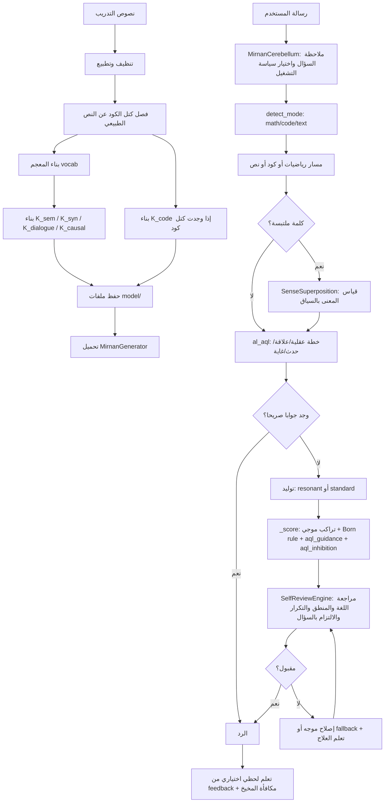

# كيف يتعلم مرنان وكيف تمر الرسالة داخله

هذه الوثيقة تشرح دورة حياة مرنان كما هي في الكود الحالي: ماذا يحدث أثناء التدريب، ماذا يحفظ في `model/`، وماذا يحدث عندما يكتب المستخدم رسالة. الغرض منها ليس التسويق للنظام، بل فهمه بهدوء: أين قوته، أين حدوده، وهل هو مؤهل ليكون نموذجا يستحق البناء عليه.

## الخلاصة

مرنان لا يتعلم بالطريقة العصبية المعروفة في النماذج الحديثة. لا يوجد `backpropagation` ولا Transformer ولا أوزان انتباه. التعلم الأساسي فيه هو:

- بناء معجم من النصوص.
- بناء مصفوفات اقتران بين الكلمات: دلالية، نحوية، حوارية، وسببية.
- تحويل الكلمة إلى متجه طوري مشتق من حروفها وخواصها الفيزيائية.
- استخدام مصفوفات الاقتران والمتجهات الطورية في التوليد.
- تحليل الكلمة الجديدة من فيزياء حروفها عبر `LexicalOracle` قبل أن تثبتها مصفوفات corpus أو `al_aql`.
- دعم تعلم لحظي من التغذية الراجعة، مع حفظ/تحميل أولي على القرص.
- دعم طبقة عقلية رمزية/سببية هي `al_aql` تصف الأشياء والأفعال والنتائج، وهي أقرب جزء إلى "الفهم البرمجي" بالمعنى الذي نعمل عليه.
- دعم متحكم داخلي خفيف هو `MirnanCerebellum` يلاحظ السؤال ويختار سياسة تشغيل ويعدل الأوزان مؤقتا.
- دعم تراكب معنى الكلمة عبر `SenseSuperposition`، حيث يمكن للكلمة الملتبسة أن تحمل أكثر من معنى ثم يرجح السياق أحدها.
- دعم مراجعة ذاتية عبر `SelfReviewEngine` تفحص الناتج وتتعلم من محاولات الإصلاح عبر ذاكرة تشخيص وذاكرة علاج.

الحكم المختصر: مرنان صار منصة تنفيذية بحثية واعدة، لا مجرد فكرة أولية. وقد بدأ الانتقال من "محركات متفرقة" إلى دورة عمل موحدة: صار `K_causal` داخلا في التقييم، وصار `K_code` يحمل تلقائيا عند وجوده، وصار `al_aql` يبني توجيها عقليا قبل التوليد العام، وصار المخيخ الداخلي يوجه المحركات، وصارت المراجعة الذاتية تفحص الناتج وتتعلم أي علاج أصلح الخلل. ما يزال بحاجة إلى تقييم معنى أوسع وقيادة أعمق لكل الردود الطويلة، لكن المسار أصبح قابلا للبناء والتجريب الجاد.

## خريطة عامة



## أنواع التعلم في مرنان

يوجد في النظام أكثر من معنى لكلمة "تعلم"، ويجب عدم خلطها:

| النوع | أين يوجد | ماذا يتعلم | هل يحفظ تلقائيا؟ |
|---|---|---|---|
| التدريب الأولي | `train.jl` | المعجم ومصفوفات الاقتران | نعم، في `model/` |
| التعلم الطوري اللحظي | `phase_reinforcement.jl` و`contextual_learning.jl` | تقوية كلمات ومسارات ناجحة | يحفظ عبر `save_runtime_learning!` عند استدعائه |
| تغذية راجعة للجمل | `language_feedback.jl` | تقييم تماسك جملة وتعزيز `K_sem` | الوحدة موجودة، لكنها ليست موصولة تلقائيا داخل `generate!` |
| تعلم الكود | `code_engine.jl` | انتقالات رموز الكود في `K_code` | يبنى ويحفظ عند التدريب إذا وجدت كتل كود |
| حدس الكلمة الجديدة | `lexical_oracle.jl` | طيف الكلمة، أقرب كلمات معروفة، جودة اللفظ، وتوليد ألفاظ مرشحة | لا يحتاج تدريباً، لأنه يعتمد على فيزياء الحرف والمعجم الحالي |
| تعلم العقل/الأفكار | `src/physics/al_aql` | كيان، صفة، فعل، نتيجة، علاقة، شرط، زمن، عملية، مجاز، نية، استثناء، قواعد موثوقة/مرشحة/مرفوضة، دروس رفض، ووسوم corpus | داخل `SimulationSpace`، ويحفظ جزء واسع منه في `runtime_learning.json` |
| التعلم السياقي من تصحيح المستخدم | `ContextualLearning.learn_from_feedback!` | مركبات، مجاز، أسماء كيانات، آثار الأفعال | يحفظ عبر `save_runtime_learning!` عند استدعائه |
| تعلم سياسة التشغيل | `MirnanCerebellum.learn_from_outcome!` | أي نمط وأي تعديلات أوزان أنجحت نوعا معينا من الأسئلة | يحفظ عبر `save_runtime_learning!` |
| تعلم التشخيص والعلاج | `SelfReviewEngine` | الخلل المتوقع في سؤال مشابه، وأي علاج رفع درجة الرد فعلا | يحفظ عبر `save_runtime_learning!` |

## مرحلة التدريب

المسار الرئيسي للتدريب في [train.jl](../train.jl).

### 1. قراءة الكوربس

الدالة `load_all_corpus` تجمع النصوص من:

- مجلدات داخل `data/`.
- ملف `data/corpus.txt` إن وجد.
- ملفات `.txt` أخرى داخل `data/`.
- مسار مخصص يمرر لسطر الأوامر.

يمكن تحديد مستوى التقسيم:

- الافتراضي الآن `--paragraph`، ويمكن ضبطه عبر `MIRNAN_SEGMENT_LEVEL=paragraph|document|line`.
- `--document`: كل ملف وثيقة واحدة.
- `--paragraph`: كل فقرة وثيقة.
- `--line`: كل سطر وثيقة.

هذا مهم لأن مصفوفات الاقتران تبنى من الكلمات القريبة داخل الوثيقة. إذا جعلنا كل ملف وثيقة طويلة جدا فقد تتقارب كلمات بعيدة لا علاقة مباشرة بينها. وإذا جعلنا كل سطر وثيقة، نخسر العلاقات الواسعة.

### 2. التطبيع والتنظيف

يطبق التدريب تطبيعا عربيا:

- توحيد بعض صور الألف والهمزة.
- تحويل `ة` إلى `ه` و`ى` إلى `ي`.
- حذف التطويل وبعض العلامات.
- حذف علامات ترقيم من حدود الكلمة.
- حذف وسوم الحوار مثل `[المتكلم]:`.

تنبيه: هذا التطبيع مفيد للإحصاء، لكنه قد يطمس فروقا لغوية دقيقة. مثلا تحويل `ة` إلى `ه` عملي لكنه ليس مثاليا في التحليل الصرفي.

### 3. فصل الكود عن النص

قبل بناء مصفوفات اللغة الطبيعية، يستخرج التدريب نوعين من الكود:

- كتل الكود المحصورة بين:

```text
```...```
```

- ملفات الكود الخام أو الملفات التي تشبه الكود، مثل ملفات `code_corpus` وملفات `.py.txt` و`.jl.txt`.

ثم يحذف الكتل المسورة من النص الطبيعي حتى لا تدخل كلمات مثل `def` و`return` في `K_sem` العربية. كتل الكود والملفات الخام تستعمل لاحقا لبناء `K_code`.

هذا تصميم صحيح؛ لأن لغة البرمجة ليست نصا عاديا. لها علاقات انتقالية ونحوية مختلفة عن اللغة البشرية.

### 3.1 استخراج معرفة al_aql من التدريب

بعد تنظيف النصوص، يبحث التدريب عن جمل سببية مرشحة، مثل:

```text
إضافة كمية من ملح إلى الماء فإنها تزيد من درجة غليانه
```

ولا يدخل كل corpus إلى `al_aql` مباشرة، حتى لا تمتلئ ذاكرة العقل بكيانات عشوائية. بل ينتقي الجمل التي تحتوي إشارات سببية وخصائص مثل: درجة، غليان، حرارة، ضغط، كثافة، سرعة، خوف، استقرار.

الجمل المنتقاة تمر عبر `train_from_text!`، ثم تحفظ المعرفة الناتجة في:

```text
model/runtime_learning/runtime_learning.json
```

وبذلك يستطيع `MirnanGenerator` تحميل هذه القوالب السببية تلقائيا بعد التدريب.

### 4. بناء المعجم

الدالة `build_vocab`:

- تعد الكلمات.
- تستبعد الكلمات غير المفيدة أو القصيرة جدا.
- تعتمد حدا أدنى افتراضيا للتكرار `3`.
- ترتب الكلمات حسب التكرار.
- تقص المعجم عند `max_vocab`.
- تحاول دمج بعض الصور القريبة جدا إذا كان تشابه متجهاتها الطورية عاليا، تقريبا `>= 0.90`.

المعجم الناتج هو:

```text
word -> id
```

وهذا المعجم هو بوابة كل مصفوفة لاحقة.

### 5. بناء مصفوفات K

الدالة `build_K` تبني مصفوفة اقتران sparse بين الكلمات. الفكرة:

إذا ظهرت كلمتان قريبتان في نافذة واحدة، ترتفع العلاقة بينهما. ثم تحول العلاقة إلى PPMI لتقليل الضوضاء.

المصفوفات الحالية:

| المصفوفة | النافذة | الاتجاه | معناها |
|---|---:|---|---|
| `K_sem` | 15 | غير سببي غالبا | اقتران دلالي واسع |
| `K_syn` | 3 | اتجاهي | اقتران نحوي/ترتيبي قريب |
| `K_dialogue` | 2 | اتجاهي | انتقالات حوارية قصيرة |
| `K_causal` | 15 | اتجاهي | تقريب سببي من ترتيب النص |

يطبق التدريب أيضا:

- تخفيف الكلمات الشائعة جدا `subsampling`.
- عقوبة لحروف المعاني والجسيمات الشائعة.
- PPMI بدلا من العد الخام.

المهم: هذه المصفوفات لا "تفهم" وحدها. هي ذاكرة اقتران. الفهم الأقرب للمنطق يأتي من جمعها مع المتجهات الطورية وطبقة `al_aql`.

### 6. الموجة الحاملة وقوالب الصرف

في التدريب يوجد جزء لتدريب اقتران الموجة الحاملة `CarrierWaveEngine` على علاقة اسم/فعل/صفة. لكنه حاليا ينشئ محركا محليا `cwe` ولا يظهر أنه يحفظه ضمن ملفات النموذج أو يمرره إلى `MirnanGenerator`.

كذلك قوالب الالتواء الصرفي `MorphoTwistor` تنشأ، لكن تعلمها متخطى حاليا مع الكوربس الكبير. ثم يحفظ ملف `twistor_patterns.json` غالبا فارغا أو محدودا.

هذه نقطة مهمة: في النصوص التوثيقية القديمة قد تبدو هذه الطبقات "مدربة"، لكن في المسار الحالي بعضها موجود كبنية أو تجربة، وليس كجزء فعال دائم بعد التحميل.

### 7. حفظ النموذج

الدالة `save_model` تحفظ:

```text
model/vocab.json
model/K_sem.dat
model/K_syn.dat
model/K_dialogue.dat
model/K_causal.dat
model/corpus_sentences.dat
model/twistor_patterns.json
```

وإذا وجدت كتل كود:

```text
model/code_vocab.json
model/K_code.dat
```

صيغة مصفوفات `K_*` هي `SPARSE_CSC` مخصصة: أبعاد، مؤشرات الأعمدة، الصفوف، والقيم.

### 8. اختبار التوليد بعد التدريب

في نهاية `train.jl` ينشأ:

```julia
MirnanGenerator(vocab, K_sem; K_syn=K_syn)
```

ثم يجرب توليد كلمات قليلة من عبارات مثل `العلم نور`.

هذا اختبار دخان، لا اختبار جودة. يثبت أن النموذج يحمل ويولد، لكنه لا يكفي للحكم على الفهم.

## ماذا يتعلم التدريب فعليا؟

التدريب يتعلم:

1. أي الكلمات موجودة في العالم النصي.
2. أي الكلمات تظهر قريبة من بعضها.
3. أي الكلمات تميل أن تأتي بعد غيرها.
4. علاقات سببية تقريبية من الاتجاه.
5. انتقالات كود إذا وجدت كتل كود.

ولا يتعلم مباشرة:

1. قواعد منطقية عميقة إلا عبر `al_aql` إذا غذيناه بها.
2. ذاكرة طويلة موحدة مثل نماذج Transformer.
3. تمثيلا عصبيا قابلا للتدرج بالخطأ.
4. حقائق موثوقة بذاتها؛ فهو لا يميز دائما بين تكرار لغوي وحقيقة.
5. تصحيحات المستخدم على القرص ما لم نضيف حفظا صريحا.

## مرحلة التحميل

يوجد مساران مهمان:

### الخادم الجذري `api_server.jl`

هذا الخادم يحاول تحميل النموذج من `model/`:

- يقرأ `vocab.json`.
- يقرأ `K_sem.dat`.
- يقرأ `K_syn.dat`.
- يقرأ `K_dialogue.dat`.
- يقرأ `K_causal.dat`.
- ينشئ `MirnanGenerator(vocab, K_sem; K_syn=K_syn)`.
- يحاول تفعيل GPU.

إذا لم يجد النموذج، يستعمل معجما تجريبيا صغيرا.

### الخادم الداخلي `src/api/server.jl`

هذا هو مسار API داخل وحدة `MirnanNew`. تم إصلاحه مؤخرا حتى لا يرجع نصا تجريبيا. الآن:

- يقبل مولدا خارجيا عبر `start_server(...; generator=gen)` أو `set_generator!(gen)`.
- إن لم يمرر له مولد، يحاول تحميل النموذج المدرب من `model/`.
- إذا لم يجد نموذجا مدربا، يعود إلى مولد افتراضي صغير.
- يستدعي `generate!` الحقيقي.

التوصية المتبقية: إزالة الازدواج بين الخادم الجذري والخادم الداخلي لاحقا، أو جعل أحدهما غلافا صريحا للآخر.

## عندما يكتب المستخدم رسالة

المسار المركزي في [generator.jl](../src/physics/engines/generator.jl) داخل الدالة `generate!`.

### 1. تنظيف أولي للرسالة

إذا كانت الرسالة فارغة يرجع رد فارغ. ثم تقسم إلى كلمات:

```julia
prompt_tokens = split(prompt)
```

مع تحويل بسيط إلى lowercase.

### 2. كشف نوع الرسالة

يستدعي `detect_mode` من `math_bridge.jl`:

| النوع | مثال | المسار |
|---|---|---|
| `math` | `2 + 3 * 4` | `_generate_math` |
| `code` | `اكتب دالة` أو `def` | `_generate_code` |
| `text` | أي نص عام | التوليد الفيزيائي |

مسار الرياضيات الآن آمن: لا يستخدم `eval` لتقييم التعبير، بل محللا حسابيا بسيطا.

### 2.5 ملاحظة المخيخ الداخلي

قبل الدخول العميق في التوليد، يقرأ `MirnanCerebellum` السؤال كحالة تشغيل:

- هل هو سؤال معنى؟
- هل يحتوي كلمة عربية ملتبسة مثل `عين`؟
- هل يميل إلى الرياضيات أو الكود؟
- هل يحتاج جوابا معياريا أم رنينيا؟
- هل توجد خبرة سابقة تقول إن هذا النوع من الأسئلة يحتاج زيادة تنوع أو التزام أقوى بالسؤال؟

الناتج هو `CerebellumPolicy`: نمط توليد، حالة `sense_mode`، ومضاعفات مؤقتة
لأوزان التسجيل. هذه السياسة لا تغير أوزان النموذج دائما؛ هي توجيه مؤقت أثناء
توليد الرد، ثم يتعلم المخيخ من جودة النتيجة.

### 3. مسار الرياضيات

إذا كشف النظام أن الرسالة رياضية:

1. يحاول `evaluate_math` حساب التعبير المباشر.
2. إن لم ينجح، يستعمل `SymbolicMathEngine`.
3. يرجع مثل: `الناتج: ...`.

هذا المسار عملي ومحدود. يصلح للحسابات الأساسية، وليس لنظام جبر رمزي كامل.

### 4. مسار الكود

إذا كشف النظام أن الرسالة برمجية:

1. يحاول `CodePhaseEngine.generate_code_physics`.
2. يتحقق من صحة الكود عبر `compile_check`.
3. إن لم ينجح، يحاول `CodeEngine.generate_code`.

إذا وجد `model/code_vocab.json` و`model/K_code.dat`، فإن `MirnanGenerator` يحملهما تلقائيا في `CodeEngine`. لذلك قدرة الكود لم تعد مجرد بنية محفوظة؛ صارت قابلة للدخول في مسار التوليد بعد التدريب. ما يزال مستوى الجودة متوقفا على وجود أمثلة كود كافية داخل كتل ``` في الكوربس.

### 5. مسار `al_aql` قبل التوليد

بعد مساري الرياضيات والكود، يستدعي `generate!` طبقة `al_aql`.

هذه الطبقة تعمل بطريقتين:

1. إن وجدت جوابا صريحا، ترجع الجواب مباشرة. أمثلة ذلك: علاقة، ظرف، حدث، عملية، مجاز، نية، استثناء، مقارنة، كم، أو وصف كيان.
2. إن لم تجد جوابا مباشرا، تبني قاموس توجيه `aql_bias` من المعرفة المتاحة، وتبني قاموس كبح `aql_inhibition` من القواعد السالبة والمرفوضة ودروس الرفض، ثم يدخلان في `_score` عبر موجتي `aql_guidance` و`aql_inhibition`.

بهذا صار `al_aql` لا يكتفي بأن يكون مخزنا خارجيا للمعرفة، بل أصبح جزءا من آلية الاختيار الفيزيائي للكلمات. الإحصاء ما زال موجودا، لكنه يصبح خادما عندما تتوفر معرفة عقلية صريحة، ويمكن للعقل الآن أن يرفع مسارا أو يكبح مسارا مخالفا.

## حفظ التعلم اللحظي

صار المولد يملك دالتين:

```julia
save_runtime_learning!(gen)
load_runtime_learning!(gen)
```

ويحفظ الملف افتراضيا في:

```text
model/runtime_learning/runtime_learning.json
```

ما يحفظه هذا الملف:

- حالة `ContextualLearning`: المركبات، المجاز، الكيانات السياقية، آثار الأفعال، وسجل التصحيحات.
- آثار `PhaseReinforcer`: المسارات المقواة وقوتها.
- جزءا واسعا من `al_aql`: الكيانات، العلاقات، الظروف، القوالب السببية، العمليات، سلاسل الأحداث، الكم، المقارنة، المجاز، النية، الاستثناء، الأضداد، القواعد الموثوقة، القواعد المرشحة، القواعد المرفوضة، دروس الرفض، ووسوم المراجعة النقدية للـ corpus.
- حالة `MirnanCerebellum`: سياسات التشغيل ومكافآتها.
- حالة `SelfReviewEngine`: سجل المراجعات، ذاكرة التشخيص، ذاكرة العلاج، وملخص التدقيق المنطقي المحلي.

وعند إنشاء `MirnanGenerator` جديد مع `model_dir` نفسه، يحاول تحميل هذا الملف تلقائيا إن وجد.

تنبيه: هذا حفظ عملي داخل JSON، وليس قاعدة بيانات معرفية كبيرة بعد. لا يزال المطلوب لاحقا تحويله إلى مخزن منظم قابل للبحث والتوسع مع ملايين الكيانات.

### 6. مسار التعلم السياقي قبل التوليد

قبل التوليد العام يستدعي:

```julia
ContextualLearning.contextual_answer(...)
```

هذا المسار قد يجيب مباشرة إذا فهم نمطا معروفا مثل:

- سؤال عن فعل.
- تركيب مجازي مثل `جيش الليل`.
- كيان تعلم من تصحيح سابق.

إذا رجع جوابا، لا يدخل في التوليد الفيزيائي الكامل، بل يسجل الرد في ذاكرة RAM ويعيده.

هذه خطوة مهمة لأنها أقرب إلى فهم قصير ومباشر من مجرد توليد احتمالي.

### 7. التخطيط الداخلي للرد

إذا لم يوجد جواب سياقي مباشر:

- يكتشف النية `_detect_intent`.
- يبني مسارا عبر `TrajectoryPlanner`.
- يستدعي `ResponsePlanner`.
- يستدعي `ResponseArchitect` لمراعاة افتتاح/جسم/خاتمة تقريبا.

هذه الطبقة لا تكتب الجواب وحدها، لكنها تؤثر في تقييم المرشحين.

### 8. اختيار نمط التوليد

إذا كان `mode="auto"`:

- إذا كانت كثافة `K_sem` أكبر من `0.001` يستخدم `resonant`.
- وإلا يستخدم `standard`.

هذا يعني أن حجم وثراء مصفوفة `K_sem` يغيران طريقة التوليد نفسها.

## التوليد الرنيني

في `_resonant_generate`:

1. يحول كلمات الرسالة إلى طور داخل متجه بطول المعجم.
2. يضرب هذا الطور في `K_sem`.
3. يضيف تأثير `K_syn` في الخطوات الأولى.
4. يغير الوزن بين النحو والدلالة حسب مرحلة الجملة:

| الخطوة | وزن `K_syn` | وزن `K_sem` | المعنى |
|---:|---:|---:|---|
| 1-3 | 0.85 | 0.15 | بداية مرتبطة نحويا بالسياق |
| 4-5 | 0.40 | 0.60 | انتقال إلى المعنى |
| بعد ذلك | 0.10 | 0.90 | توسع دلالي |

5. يأخذ أقوى المرشحين.
6. يضيف `topic_resonance`.
7. يطبق softmax داخليا للاختيار بين المرشحين.
8. يمنع تكرار الكلمات المستخدمة.

هذا المسار سريع نسبيا، لكنه يعتمد كثيرا على جودة `K_sem` و`K_syn`.

## التوليد القياسي

في `_standard_generate`:

1. يحسب متجهات طورية لكلمات prompt.
2. يمتصها في `PromptField`.
3. يبني `DensityMatrix`.
4. يبدأ beams.
5. في كل خطوة يستخرج مرشحين من `K_sem`.
6. يقيم كل مرشح عبر `_score`.
7. يحتفظ بأفضل beams.

هذا المسار أبطأ وأغنى في التقييم، لأنه يستدعي محركات كثيرة.

## دالة التقييم `_score`

هذه أهم دالة في التوليد. لا تختار الكلمة بناء على `K_sem` فقط، بل تجمع مساهمات كثيرة كأنها موجات:

```text
كل محرك يعطي:
amplitude + phase

ثم:
wave_superposition(...)
ثم:
Born rule => احتمال
```

المحركات الداخلة في التقييم تشمل:

- مزامنة كوراموتو.
- بوابة الإنتروبيا.
- التدفق السببي.
- الهوي/الجذب التراكمي.
- التغاير الترددي.
- سلسلة الرنين.
- قرب الطور من آخر كلمة.
- قرب الطور من prompt.
- التنوع ومنع التكرار.
- الجاذبية الدلالية.
- المجال النحوي.
- مصفوفة الكثافة.
- DCCF.
- PPM.
- قرب الجذر والسطح.
- توتر السياق.
- توجيه `al_aql` عبر `aql_guidance`.
- كبح `al_aql` عبر `aql_inhibition`.
- `K_sem`.
- مسار الاستجابة `Trajectory`.
- معمارية الرد `Architect`.

نقطة القوة هنا: القرار ليس مجرد أكثر كلمة تكررت بعد أخرى، بل نتيجة تداخل إشارات متعددة.

نقطة الضعف: كثرة المحركات تجعل تفسير سبب اختيار كلمة معينة صعبا ما لم نوثق مساهمة كل محرك في تقرير توليد.

## المراجعة الذاتية بعد التوليد

بعد أن ينتج المولد نصا، لا يصبح النص نهائيا مباشرة. يدخل إلى `SelfReviewEngine`
التي تفحص:

- سلامة اللغة الأساسية.
- الاتساق الطوري بين الكلمات.
- التكرار المفرط.
- توافق الرد مع prompt.
- خلط العربية واللاتينية عند عدم الحاجة.
- التناقضات البسيطة عبر `BayanLogicKernel`.
- الحسابات الرقمية البسيطة إذا ظهرت في النص.

إذا كان الرد مقبولا، يرجع للمستخدم ويتعلم المخيخ مكافأة موجبة نسبيا. وإذا كان
ضعيفا، يحاول المولد إصلاحا موجها: زيادة التنوع، تقوية الالتزام بالسؤال، تقوية
المنطق، الرجوع إلى `standard_mode`، أو استعمال `fallback`.

المهم أن مرنان لا يتعلم فقط "هذا الرد سيئ". صار يتعلم أيضا:

```text
في هذا النوع من السؤال، هذا العلاج رفع الدرجة.
```

لذلك توجد ذاكرتان:

- `review_memory`: تتوقع نوع الخلل.
- `treatment_memory`: تتوقع العلاج الذي نجح فعلا.

## الذاكرة أثناء الرد

بعد توليد رد غير فارغ:

```julia
RAMCore.observe!(gen.ram, prompt_tokens + response_tokens)
```

أي أن الرد يدخل في ذاكرة زمنية داخل الجلسة. هذه الذاكرة تساعد أثناء التشغيل، لكنها ليست بالضرورة محفوظة بعد إغلاق البرنامج.

## التعلم من المستخدم بعد الرد

المسار الأوضح هو:

```julia
learn_from_feedback!(gen, prompt, response; rating, note)
```

هذا يفعل عدة أمور:

1. يسجل التصحيح في `feedback_log`.
2. يتعلم المركبات اللفظية الموجودة في prompt.
3. إذا احتوت الملاحظة على أن شيئا ما `اسم` أو `كيان` أو `قبيلة`، يسجله ككيان مسمى.
4. إذا احتوت الملاحظة على إشارات مجاز، يتعلم المجاز.
5. إذا كان التقييم موجبا، يتعلم آثار الأفعال من الرد.
6. يعزز متجهات الكلمات في `PhaseReinforcer`.
7. يزيد اقترانات `K_sem` بين الكلمات المتتابعة في الرد.

مثال منطقي:

```julia
learn_from_feedback!(
    gen,
    "ماذا فعل جيش الليل",
    "جيش الليل قبيلة في الرواية",
    rating=1.0,
    note="جيش الليل اسم قبيلة في روايتي",
)
```

بعدها يميل مرنان إلى عدم تفسير `جيش الليل` كمجاز فقط، بل ككيان سياقي.

## مسار SIO

يوجد أيضا [SIO.jl](../src/sio/SIO.jl)، وهو منسق مهام أعلى من التوليد العادي:

```text
GoalParser -> PhasePlanner -> PhaseExecutor -> SelfMonitor -> Integrator
```

إذا كتب المستخدم هدفا كبيرا مثل تقرير أو كود أو قصة، يستطيع SIO تقسيمه إلى مراحل:

- تخطيط.
- بحث/معرفة.
- كتابة.
- مراجعة.
- دمج.

لكن SIO ليس المسار الوحيد لكل رسالة. الواجهات العادية غالبا تستدعي `generate!` مباشرة.

## طبقة al_aql وعلاقتها بالفهم

طبقة `al_aql` ليست مجرد مولد كلمات. هي نظام تمثيل معرفي:

```text
أشياء + حدث + نتيجة
```

داخل `SimulationSpace` توجد:

- كيانات.
- أفعال ديناميكية.
- قواعد سببية.
- قوالب سببية.
- عمليات مفهومية.
- ظروف مكان وزمان.
- علاقات ثابتة.
- كم ومقارنات.
- مجاز.
- نية وغاية.
- استثناءات.

مثال المعنى الذي نريده:

```text
ملح + أضيف إلى ماء -> ارتفاع درجة الغليان
```

هذا النوع من المعرفة لا ينبغي أن يبقى في `K_sem` فقط؛ لأن `K_sem` تقول "هذه الكلمات تقاربت"، أما `al_aql` فيقول "هذا فعل وقع على شيء فأنتج أثرا".

لذلك `al_aql` هو أقوى مرشح ليكون قلب الفهم البرمجي في مرنان.

## هل مرنان يفهم؟

الجواب الدقيق: مرنان يملك بدايات فهم مركب، لكنه ليس فهما عاما مكتملا.

هو يفهم بمعنى:

- يستطيع تمثيل الكلمة كحزمة خواص لا كرمز فقط.
- يستطيع ربط الكلمات عبر سياق ودلالة ونحو.
- يستطيع تمثيل الفكرة في `al_aql` كأشياء وحدث ونتيجة.
- يستطيع التعامل مع شرط وزمن ونفي ومجاز وعلاقة ثابتة في الطبقة العقلية.
- يستطيع تحويل بعض الأسئلة إلى خطة عقلية قبل التوليد: علاقة، ظرف، حدث، عملية، مجاز، نية، استثناء، مقارنة، أو كم.
- يستطيع إدخال موجتي `aql_guidance` و`aql_inhibition` في `_score` حتى تؤثر معرفة `al_aql` في اختيار الكلمات أو تمنع مرشحا مخالفا عند غياب جواب مباشر.
- يستطيع تمثيل الكلمة الملتبسة كحالة تراكب معان، ثم يرجح معنى بالسياق عبر `SenseSuperposition`.
- يستطيع مراجعة الرد بعد توليده، ثم محاولة إصلاحه وتعلم العلاج الناجح عبر `SelfReviewEngine`.
- يستطيع أن يتعلم بعض التصحيحات أثناء الجلسة.

ولا يفهم بعد بمعنى:

- لا يملك حتى الآن قاعدة بيانات معرفية كبيرة مخصصة لملايين القواعد والكيانات، بل يحفظ طبقة التشغيل الحالية في JSON.
- ربط `al_aql` بمسار `generate!` تقدم: يتعلم من الجمل الخبرية، ويجيب عن العلاقات والظروف والأحداث والعمليات والمجاز والنية والاستثناء والمقارنة والكم عند توفر معرفة صريحة، ويؤثر في التوليد عبر `aql_guidance` و`aql_inhibition`. لكنه ليس بعد قائدا كاملا لكل رد طويل ومركب.
- معجم تراكب المعاني محدود، ويحتاج توسعة كبيرة قبل أن يصبح طبقة فهم دلالي عامة.
- المراجعة الذاتية تكشف أخطاء عملية مهمة، لكنها ليست حكما كاملا على الحقيقة أو البرهان.
- لا يملك تقييما معياريا كبيرا يقيس صحة الردود على بيانات خارجية.
- بعض وحدات التعلم موجودة لكنها غير موصولة في المسار الرسمي.
- مسار الكود يحمل `K_code` تلقائيا عند وجودها، والتدريب صار يلتقط ملفات الكود الخام. لكنه يحتاج كوربس كود أغنى واختبارات برمجية أوسع.

## هل هو أهل ليصبح نموذجا كفؤا؟

نعم، إذا عرفنا "الكفاءة" بأنها كفاءة نموذج بحثي سببي/برمجي متميز، لا كفاءة منافسة فورية لنموذج Transformer عام.

أسباب القوة:

1. لديه تمثيل غير عادي للكلمة يعتمد على الحرف والطور والكتلة والتردد.
2. لديه مصفوفات اقتران قابلة للتفسير أكثر من أوزان neural مبهمة.
3. لديه طبقة `al_aql` التي تمثل الفكرة كما تريدها: أشياء، حدث، نتيجة.
4. يستطيع أن يستوعب مجالات متعددة بنفس القالب: فيزياء، حوار، برمجة، أخلاق، علاقات.
5. قابل للتطوير بقاعدة بيانات معرفية لا بكتابة الأشياء في الكود.
6. صار يملك متحكما داخليا يوجه المحركات قبل التوليد، لا مجرد مولد ينتظر الأوزان.
7. صار يراجع الناتج ويتعلم من علاجات الإصلاح، وهذا يضيف دورة تغذية راجعة داخلية.

أسباب الضعف الحالي:

1. التوليد اللغوي ما زال يعتمد كثيرا على `K_sem/K_syn` في الردود التي لا يملك لها `al_aql` معرفة صريحة.
2. قيادة `al_aql` ما زالت جزئية: تقود الأسئلة المنظمة وتوجّه `_score`، لكنها لا تبني بعد كل جواب طويل كخطة متعددة المقاطع.
3. التغذية الراجعة صار لها حفظ/تحميل أولي، ودخلت فيها ذاكرة العلاج، لكنها لا تزال تحتاج سياسة حفظ تلقائي وقاعدة معرفة أمتن.
4. الخادمان يحتاجان توحيدا.
5. تقييم الجودة يحتاج اختبارات معنى، لا اختبارات تشغيل فقط.
6. تراكب المعنى والمنطق المحلي ما زالا محدودين بأمثلة وقواعد صغيرة.

## ماذا نحتاج ليصبح أقرب إلى الكفاءة؟

الأولوية الأولى:

- تم جزئيا: الخادم الداخلي يحمل النموذج المدرب افتراضيا، والخادم الجذري يمرر `K_causal`.
- تم: أضيفت خطة عقلية داخل `generate!` للعلاقات والظروف والأحداث والعمليات والمجاز والنية والاستثناء والمقارنة والكم.
- تم: أضيفت قناة `aql_guidance` داخل `_score` حتى تضغط معرفة `al_aql` على اختيار الكلمات.
- تم: أضيفت قناة `aql_inhibition` داخل `_score` حتى تكبح القواعد السالبة والمرفوضة ودروس الرفض المرشحات غير الصالحة.
- تم جزئيا: حفظ/تحميل `ContextualLearningState` و`PhaseReinforcer` ومعرفة `al_aql` الواسعة، بما يشمل العلاقات والقوالب والعمليات والسلاسل والكم والمقارنة والمجاز والنية والاستثناء والقواعد الموثوقة/المرشحة/المرفوضة ووسوم corpus.
- تم: تحميل `K_code` تلقائيا في `MirnanGenerator` عند وجود ملفات الكود.
- تم: إضافة `MirnanCerebellum` لتوجيه نمط التوليد وأوزانه والتعلم من النتيجة.
- تم: إضافة `SenseSuperposition` لتراكب معنى الكلمة وانهياره بالسياق.
- تم: إضافة `SelfReviewEngine` للمراجعة الذاتية وذاكرة التشخيص وذاكرة العلاج.

الأولوية الثانية:

- إضافة تقرير تفسير لكل توليد: لماذا اختيرت الكلمة؟ كم ساهم `K_sem`؟ كم ساهم النحو؟ كم ساهم `al_aql`؟
- تم: تحويل `K_causal` إلى مصدر فعلي في CausalFlow، مع الرجوع إلى `K_sem` عند غيابه.
- جعل `LanguageFeedbackEngine` يعمل تلقائيا بعد كل رد إذا كان مفعلا.
- بناء اختبارات فهم: شرط، سبب، نتيجة، مجاز، نفي، علاقة، هدف.
- توسيع قاموس `SenseSuperposition` وربطه لاحقا باستخراج آلي من corpus أو `al_aql`.
- جعل تقرير `SelfReviewEngine` جزءا ظاهرا من تقارير التوليد والتشخيص.

الأولوية الثالثة:

- قاعدة بيانات موحدة للمعرفة العقلية: كيانات، فئات، قواعد، عمليات، علاقات.
- توسيع واجهة التدريب النصي التي تحول الجمل إلى ADL/`al_aql` تدريجيا؛ بدأ ذلك بجمل التأثير السببي مثل إضافة الملح ورفع درجة الغليان.
- دعم إنجليزي أعمق للتخطيط البرمجي، مع فصل واضح بين لغة طبيعية وكود.

## مسار مقترح للمرحلة التالية

أفضل تطوير تال ليس إضافة محرك جديد، بل ربط ما لدينا:

```text
رسالة المستخدم
 -> تحليل لغوي أولي
 -> استخراج كيانات وأفعال وعلاقات عبر al_aql
 -> سؤال قاعدة al_aql: هل هناك قاعدة/نمط/علاقة؟
 -> إن وجدت نتيجة معرفية: صغ جوابا موجها بها
 -> إن لم توجد: استخدم generate! الفيزيائي
 -> قيّم الرد
 -> احفظ ما تعلمته
```

بهذا يصبح مرنان أقرب إلى نموذج يفكر: لا يكتفي بترجيح كلمة بعد كلمة، بل يحاول أولا أن يرى "الفكرة" ثم يكتب.

## الحكم النهائي

مرنان الآن ليس مجرد لعبة توليد. فيه نواة حقيقية لنموذج مختلف: نموذج يجمع بين اقتران إحصائي، فيزياء طورية، وتمثيل عقلي سببي. أكثر ما يستحق البناء عليه هو `al_aql` وربطه بالتوليد والتدريب.

إن أردنا له الكفاءة، فالطريق ليس تضخيم `_score` بمحركات أكثر، بل جعل دورة الفهم صريحة:

```text
نص -> كيان/فعل/نتيجة -> قاعدة/استثناء/زمن/شرط -> جواب -> تعلم محفوظ
```

عندها يمكن أن يصير مرنان نموذجا له شخصية هندسية واضحة: ليس نسخة صغيرة من Transformer، بل نموذج سببي قابل للتفسير.
