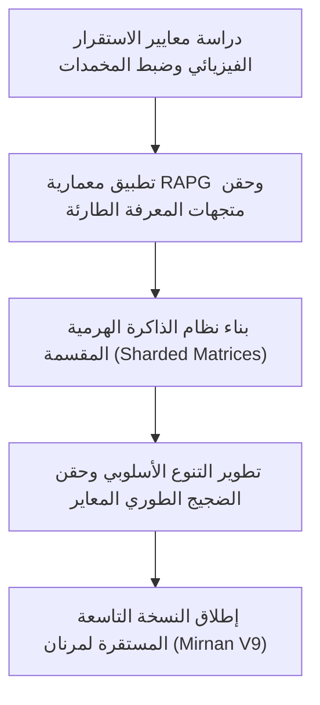

# خارطة الطريق المستقبلية لتطوير مرنان (Mirnan Future Roadmap)

تهدف هذه الوثيقة إلى وضع خطة استراتيجية تقنية لمعالجة التحديات والقصور ونقاط الضعف الحالية في مرنان V8، وتحويل المعمارية من معمارية تجريبية مغلقة إلى نظام لغوي إدراكي ناضج وقابل للتوسع.

---

## 1. استقرار المحركات الفيزيائية ومنع الفوضى (Physics Stability & Damping)

> [!WARNING]
> **التحدي الحالي**: التغيرات الطفيفة في أوزان الجاذبية الدلالية أو النحوية تتسبب في انهيار التماسك النحوي (Grammatical Fragmentation) أو الوقوع في حلقات تكرار مفرغة نتيجة الحساسية العالية لمعادلات المتذبذبات غير الخطية.

### الحلول المقترحة:

| المكون المقترح | الوصف التقني | الهدف |
| :--- | :--- | :--- |
| **المخمدات الديناميكية (Dynamic Dampers)** | إضافة معامل تخميد (Damping Coefficient) يتناسب طردياً مع إنتروبيا التوليد في معادلات متذبذبات كوراموتو. | إبطاء التباعد الطوري للكلمات ومنع التداخل الهدام عندما تزداد فوضى الجملة. |
| **المراسي النحوية الطورية (Syntactic Phase Anchors)** | حفر مسارات جاذبية قوية (Attractor Basins) في فضاء الطور تمثل الروابط النحوية الشائعة. | سحب متجه التوليد قسرياً نحو تراكيب لغوية مستقرة عند اقتراب النظام من حالة الفوضى. |
| **المعايرة الذاتية المستمرة (Cerebellum Auto-Tuning)** | توسيع منطق المخيخ (Cerebellum Policy) ليعمل كمتحكم تغذية راجعة (PID Controller). | قياس جودة النص المنتج (إنتروبيا التحول، النقاء الطيفي) في الوقت الحقيقي وضبط الأوزان ديناميكياً لتظل ضمن النطاق الآمن. |

---

## 2. التوسع المعرفي وتجاوز نطاق التدريب المغلق (Open-Domain Scaling)

> [!IMPORTANT]
> **التحدي الحالي**: مرنان محصور دلالياً بنطاق المعجم والنصوص التي تدرب عليها (hayat corpus)، ويعجز عن معالجة أو فهم المفاهيم والمعارف العامة خارج هذا النطاق الضيق.

### الحلول المقترحة:

### أ. التوليد الفيزيائي المسترد (Retrieval-Augmented Physics Generation - RAPG)
* **الفكرة**: ربط مرنان بقاعدة بيانات متجهات (Vector Database) خارجية تحتوي على معارف واسعة (مثل ويكيبيديا العربية).
* **طريقة العمل**:
  1. عند تلقي سؤال خارجي، يتم البحث في قاعدة البيانات واسترجاع الفقرات الأكثر شبهاً.
  2. يتم توليد **مراكز ثقل طورية مؤقتة (Temporary Paragraph Centroids)** لهذه الفقرات وحقنها في ذاكرة مرنان اللحظية.
  3. يقوم المحرك الفيزيائي بالتوليد بالاعتماد على هذه المراسي المعرفية الطارئة دون الحاجة لإعادة تدريب النموذج بالكامل.

### ب. بنية الذاكرة الهرمية المتفرقة (Hierarchical Sparse Memory)
* تقسيم المصفوفات الدلالية (`K_sem`) إلى طبقات:
  * **النواة (Core Matrix)**: تحتوي على البنية النحوية الأساسية والحروف والمعجم الصغير الدائم.
  * **الشرائح المعرفية (Domain Shards)**: مصفوفات متفرقة يتم تحميلها ديناميكياً إلى الذاكرة بناءً على موضوع الاستعلام (طب، تقنية، حوار، إلخ).

### ج. الجسر الهجين الإدراكي (Hybrid Cognitive Bridge)
* استخدام نموذج لغوي عصبي ضخم (مثل Llama-3-Arabic) كمولد للمسوّدات التعبيرية الطليقة، واستخدام **مرنان كمدقق إدراكي (Cognitive Auditor)**؛ حيث يقوم مرنان بتحليل النص المنتج للتأكد من دقته المنطقية وخلوه من الهلوسة بناءً على حقل الجاذبية وقواعد الاستنباط.

---

## 3. مرونة التعبير والتنوع الأسلوبي (Stylistic Fluidity & Diversity)

> [!NOTE]
> **التحدي الحالي**: جمل مرنان تميل إلى أن تكون مباشرة وقصيرة وصارمة نحوياً، مما يعطي انطباعاً بالجفاف التعبيري وغياب التنوع الجمالي والبلاغي.

### الحلول المقترحة:

1. **حقن الضجيج الطوري المتغير (Variational Phase Noise)**:
   * إدخال ضجيج طوري خاضع للتحكم (شبه عشوائي) في متذبذب ستيوارت-لانداو (Stuart-Landau) لنموذج PRNN. هذا يتيح للنظام اختيار كلمات مترادفة ومسارات بديلة تعطي نفساً تعبيرياً مختلفاً في كل مرة يتم فيها طرح نفس السؤال.
2. **توسيع أنماط اللسان (Lisan Style Templates)**:
   * تدريب مصفوفات النحو (`al_lisan`) على أنماط أدبية متعددة (أسلوب روائي، أسلوب علمي جاف، أسلوب صحفي تلخيصي)، والسماح للمستخدم أو المخيخ باختيار "نبرة الصوت" (Tone of Voice) المطلوبة قبل بدء التوليد.
3. **التوليد ثنائي الاتجاه / متعدد التمريرات (Multi-Pass Wave Generation)**:
   * توليد مسودة أولية سريعة، ثم تشغيل تمريرة فيزيائية معاكسة (من النهاية إلى البداية) لدمج الصفات، وحروف العطف، وأدوات الربط المناسبة لتنعيم الهيكل النحوي للجملة.

---

## 4. خطة العمل المقترحة للتنفيذ (Action Plan)

> [!TIP]
> نقترح البدء بـ **المرحلة الأولى (المخمدات والضبط الذاتي للأوزان)** لأنها ستحمي النظام الحالي فوراً من أي تفكك نحوي أثناء زيادة حجم البيانات، ثم الانتقال لـ **المرحلة الثانية (RAPG)** لفتح آفاق المعرفة العامة لمرنان.
