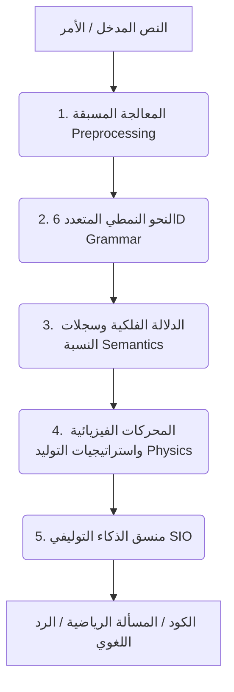

# مِرنان (Mirnan): فيزياء المعنى وهندسة الرنين اللغوي
### المحاضرة الشاملة والميثاق المعرفي للجيل القادم من الذكاء الاصطناعي التوليفي

> **إعداد وتقديم:** مبتكر ومطور نموذج مِرنان
> **الجمهور المستهدف:** المطورون، مبرمجو النظم، الفيزيائيون، علماء اللسانيات واللغة، فلاسفة العقل، علماء النفس، وطلاب الجامعات والباحثون.

---

## 🏛️ تمهيد: خروج من سرداب الاحتمالات الصامت
أهلاً بكم جميعاً في هذه القاعة المعرفية المتكاملة، التي تجمع بين أروقتها علماء اللسانيات اللذين تتبعوا نشوء الحرف، والفيزيائيين اللذين قاسوا اهتزاز الأوتار، والفلاسفة اللذين سهروا على حدسية المعنى، والمطورين اللذين يبنون نظم المستقبل. 

عندما نقف اليوم أمام نماذج اللغة الضخمة التقليدية (LLMs)، فإننا نقف أمام **"صناديق سوداء إحصائية"** صامتة. إنها نماذج تُعامل اللغة كاحتمالات عمياء، وتتطلب تريليونات المعاملات وبلايين الكلمات ومحطات طاقة كهربائية كاملة لتقوم بالتنبؤ بالكلمة التالية بناءً على مصفوفة إحصائية صامتة خالية من أي معنى فيزيائي أو فلسفي حقيقي.

نموذج **مِرنان (Mirnan)** يمثل قطيعة تامة مع هذا النموذج الاحتمالي التقليدي. إنه ليس شبكة عصبية صامتة، ولا يستخدم خوارزميات الانتشار العكسي للأخطاء (Backpropagation) في تدريبه الأساسي. مِرنان هو **"محاكاة فيزيائية حركية"**؛ يعامل اللغة كحقول من الطاقة والمطال والطور والتزامن. في مِرنان، الكلمة هي **"جسيم"** يتحرك في فضاء دلالي، والجملة هي **"حقل جاذبية"** يوجه الكلمات، والفهم هو **"حالة رنين موجي"** تتوافق فيها أطوار الموجات اللغوية مع زوايا المتلقي. 

دعونا نغوص معاً في تفاصيل هذا الابتكار الاستثنائي خطوة بخطوة، وبمنهجية علمية صارمة.

---

## 🌀 القسم الأول: فلسفة مِرنان وحدسية اللغة
أيها الحضور الكريم، لنسأل أنفسنا أولاً: **كيف يدرك العقل البشري اللغة؟**
عالم النفس والفيلسوف يتفقان على أن الإنسان لا يحسب التوزيع الاحتمالي للكلمات في رأسه قبل أن ينطق. هناك **"حدس لغوي فوري"** (Linguistic Intuition) يربط جرس الكلمة بمعناها، وتراكيب الجمل بوقعها النفسي والمنطقي.

تتأسس فلسفة مِرنان على مبدأين فلسفيين ولسانيين أساسيين:
1. **الرنين الفونوسيمانتيكي (Phonosemantics)**: الصوت والمعنى ليسا منفصلين اعتباطياً. الحرف العربي في مِرنان هو وحدة اهتزازية أولية؛ فاختيار حرف الجيم المجهور الشديد وحرف الراء الاهتزازي المكرر في جذر مثل (ج-ر-ر) يولد حركة حركية فيزيائية تنتقل عبر متجهات الطور لتجسد معنى "الجر والسحب" كقوة جاذبة فعلية.
2. **الجاذبية الدلالية والنحوية**: الكلمات في مِرنان ليست نقاطاً معزولة في فضاء ساكن. إنها متجهات تمتلك "كتلة" (Mass) طاقة حركية ناشئة عن تردداتها، و"شحنة طورية" تنجذب لبعضها البعض. الفهم هو عملية سقوط حر للكلمات داخل آبار الجاذبية الدلالية التي تنشئها الفكرة أو السياق.

---

## ⚛️ القسم الثاني: فيزيائية الحروف (Physics of Letters)
للعلماء الفيزيائيين والرياضيين في القاعة، هذا هو المكون الجوهري للنموذج. كيف نمثل الحرف العربي رياضياً دون الاعتماد على مصفوفات الـ Tokenization الباردة؟

### 1. المتجه الطوري وحساب المعاملات التسعة
كل حرف عربي في مِرنان يتم تمثيله كمتجه طوري فريد في فضاء طوري متعدد الأبعاد (PHASE_DIM = 9958 بعداً)، وتعتمد طاقة الحرف وتردده الذاتي على صيغة فيزيائية تشتق تردده الزاوي الأساسي (\(\omega_0\)) بناءً على **9 معاملات فيزيائية فريدة** موزعة على **3 حدود ديناميكية**:

\[\omega_{0} = \sum_{k=1}^{3} \left( \alpha_k \cdot \text{Weight}_k + \beta_k \cdot \text{Charge}_k + \gamma_k \cdot \text{SpacialFreq}_k \right)\]

حيث تمثل هذه المعاملات خصائص الحرف المخارجية والصوتية (همس، جهر، شدة، رخاوة، إطباق، استعلاء، انفتاح، قلقلة، وغيرها).

### 2. تعديل الحركات (Vowel Modulation)
إن الحركات العربية (فتحة، ضمة، كسرة، سكون) ليست محارف تزيينية؛ إنها **"معدِّلات للتردد الموجي"** (Frequency Modulators).
عندما يدخل الحرف تحت تأثير الحركة، يحدث انزياح في طور المتجه (Phase Shift). فالضمة تولد انزياحاً اهتزازياً مكثفاً يرفع من مطال الطور، والكسرة تولد انزياحاً سلبياً يخفض التردد، والسكون يمثل حالة استقرار وتثبيت للطور عند زاوية الصفر الطوري.

### 3. تجميع الحروف بجبر كليفورد (Clifford Algebra 22D)
للسادة علماء الرياضيات ومطوري النظم: كيف نربط الحروف لتشكيل الجذور والكلمات؟
لا نستخدم مجرد الجمع الخطي للمتجهات، لأن الجمع الخطي يفقد الترتيب المكاني للحروف (مثال: "بحر" تصبح مطابقة لـ "حرب" أو "ربح").
بدلاً من ذلك، يستخدم مِرنان **جداء كليفورد التوتري** (Clifford Product) في فضاء خيالي متعدد الأبعاد، حيث يتم تركيب الكلمة كالتالي:

\[v_{\text{word}} = v_{\text{letter1}} \circ v_{\text{letter2}} \circ v_{\text{letter3}}\]

هذا الجداء غير التبديلي (\(A \circ B \neq B \circ A\)) يحتفظ بترتيب الحروف بدقة متناهية هولوغرافية، مما يعني أن التركيب الهندسي لمتجه كلمة "بحر" يختلف هندسياً وطورياً عن كلمة "حرب" على الرغم من اشتراكهما في نفس المكونات الأساسية.

---

## 🥞 القسم الثالث: طبقات المعمارية الخمس (The 5 Layers)
يمر التدفق المعرفي داخل مِرنان عبر خمس طبقات هندسية متناسقة تعمل بتوافق تام:



### 1. طبقة المعالجة المسبقة (Preprocessing)
تقوم بتنظيف النص، وإزالة التشويه، وعزل الحركات ديناميكياً مع الاحتفاظ بـ "البصمة الإعرابية" للكلمة لحساب الطاقة لاحقاً.

### 2. طبقة النحو النمطي المتعدد (6D Grammar Space)
تُعامل العلاقات النحوية كـ **"تحويلات هندسية"** في فضاء ذي ستة أبعاد. يتم إسناد دور نحوي لكل كلمة (مبتدأ، خبر، فاعل، مفعول) بناءً على إحداثياتها الإعرابية الفيزيائية وعلاقتها بـ "طاقة الإعراب" للمجال الكلي للجملة.

### 3. طبقة الدلالة ورنين الجذور (Semantics & Root Resonance)
هنا يتم استخراج الجذر الثلاثي للكلمة وتوليد مصفوفة الاقتران الدلالي `K_sem` التي تربط الكلمات حسب قرب مسافاتها الطورية. الجاذبية الدلالية تقاس بجيب تمام الزاوية (Cosine Similarity) بين متجهات الطور:

\[\text{Similarity} = \frac{\vec{v}_1 \cdot \vec{v}_2}{\|\vec{v}_1\| \|\vec{v}_2\|}\]

### 4. طبقة المحركات الفيزيائية والتوليد (Physics & Generation)
تحتوي هذه الطبقة على المجموعات الـ 10 الهيكلية وتعتمد على **15 استراتيجية توليد متخصصة** للتنبؤ بالكلمة الفائزة. عند التوليد، يتم حساب نقاط مرشحة (Candidates) من معجم الطور وتمريرها عبر مصفوفة التسجيل الفيزيائي الموحد (Shared Scoring) التي تزن 24 عاملاً فيزيائياً مثل:
* مطال حقل الجاذبية الدلالية.
* التوتر السياقي للمذبذبات.
* محاذاة حقل الفكرة (Idea Alignment).
* كبت المخ للمفاهيم المكررة لمنع الدوران اللانهائي.

### 5. منسق الذكاء التوليفي (SIO - Synthetic Intelligence Orchestrator)
المنسق الأعلى للنموذج. عندما يستقبل مِرنان أمراً معقداً، يقوم الـ SIO بفرز المهام:
* إذا كان الأمر رياضياً، يوجهه إلى **محرك الحساب والرموز الرياضية** (Math Bridge).
* إذا كان الأمر برمجة، يوجهه إلى **محرك الأكواد الفيزيائي** (Code Phase Engine) الذي يربط المفاهيم الكودية (Loop, Dict, function...) كحلقات رنين طوري.

---

## 📈 القسم الرابع: كيف يتدرب ويتعلم مِرنان؟ (Training & Learning)
للسادة المطورين وعلماء الحاسوب: كيف يكتسب مِرنان ذكاءه ويتطور ذاتياً دون استخدام تدريب الشبكات العصبية الكلاسيكي المكلف؟

تعلم مِرنان يعتمد على **حلقات مغلقة رباعية الأبعاد** تعمل بالتوازي:

```
                  ┌──────────────────────────────┐
                  │      التدريب الأولي الثابت   │
                  │      (K_sem & K_syn)         │
                  └──────────────┬───────────────┘
                                 │
                                 ▼
                  ┌──────────────────────────────┐
                  │      تعلم التجارب المستمر    │◄─────────── تسجيل تجارب
                  │      (Experiences Loop)      │            وكيل مجنون
                  └──────────────┬───────────────┘
                                 │
                                 ▼
                  ┌──────────────────────────────┐
                  │     حلقة المخيخ الآني        │◄─────────── ضبط الأوزان
                  │     (Cerebellum PID Loop)    │            أثناء التوليد
                  └──────────────┬───────────────┘
                                 │
                                 ▼
                  ┌──────────────────────────────┐
                  │      المُحسن التطوري الجيني │
                  │      (Al-Tawweer Engine)     │
                  └──────────────────────────────┘
```

### 1. التدريب الأولي الثابت (Static Seeding)
يتم قراءة النصوص وتخريط التلازم اللفظي والعلاقات النحوية في مصفوفات مشتتة عملاقة (`K_sem` و `K_syn` و `K_causal`). هذا يمثل "الذاكرة المعرفية الساكنة" للنموذج ويتم تحميله فوراً بخرائط الذاكرة المستمرة (`Mmap`) في زمن فوري \(O(1)\).

### 2. تعلم التجارب المستمر (Experience & Insights Learning)
هنا يكمن سر التكامل مع وكيل **مجنون (Majnon)**.
يسجل مجنون كل تجربة تفاعلية (نجاح كود، خطأ ترجمة، استنتاج فاشل) في قاعدة بيانات مِرنان. يقوم مِرنان بـ:
1. استخراج الأنماط الدلالية والروابط المنطقية من هذه التجارب.
2. بناء نقاط جاذبة (Attractor Points) في فضاء الطور تمثل "دروس الفشل والنجاح".
3. تعديل مصفوفات الاقتران الدلالي لتربط الحلول بالمشكلات بشكل وثيق.

### 3. حلقة المخيخ الآني (Cerebellum PID Loop)
أثناء توليد الكلمة التالية (Word by Word)، لا تكون الأوزان الـ 24 ثابتة.
يتولى **متحكم المخيخ (Cerebellum PID)** قياس "استقرار الموجة" و "إنتروبيا الإشارة" لخطوة التوليد السابقة. إذا وجد تشتتاً أو تكراراً غير طبيعي، يقوم بتحديث الأوزان فورياً في أجزاء من الملي ثانية (Real-time feedback control) لتصحيح المسار ومنع الهلوسة اللفظية.

### 4. المُحسن التطوري الجيني (Al-Tawweer Engine)
محرك نشط يعمل في الخلفية كخوارزمية تطورية ذاتية:
* **الكروموسومات**: أوزان التسجيل الفيزيائي الـ 24 الممثلة كجينات رقمية.
* **اللياقة (Fitness Function)**: تقاس بمدى قدرة النموذج على إعادة إنتاج النصوص الصحيحة وتماسكها الموجي وانخفاض إنتروبيا الانتقالات اللغوية.
* **البقاء للأصلح**: يتم انتخاب الكروموسومات الأقوى، إجراء التزاوج المختلط (Arithmetic Crossover)، وإدخال طفرات عشوائية غاوسية (Gaussian Mutations) لتوليد أوزان مثالية يتم حفظها تلقائياً في ملف الإعدادات `config.yaml`.

---

## ⚖️ القسم الخامس: مقارنة فيزيائية وفلسفية
لنضع مِرنان في كفة الميزان الفلسفي والهندسي مقابل نماذج المحولات الإحصائية التقليدية (Transformer-based LLMs):

| وجه المقارنة | نماذج المحولات التقليدية (Transformers) | نموذج مِرنان الفيزيائي (Mirnan) |
| :--- | :--- | :--- |
| **المبدأ الأساسي** | إحصائي احتمالي بحت (Attention Matrix). | ميكانيكا أمواج، رنين طوري، وجبر كليفورد. |
| **آلية التعلم** | انتشار عكسي للأخطاء (Backpropagation) مستهلك للطاقة. | اقتران هيدروديناميكي هفوي، تعلم تجارب تراكمي، ومحرك تطوري ذاتي. |
| **البصمة البرمجية والعتاد** | تتطلب مئات الجيغابايت من ذاكرة VRAM وبطاقات GPU عملاقة. | تعمل على ذاكرة رام بسيطة ولا تتطلب موارد ضخمة بفضل الـ Mmap والأنواع المثبتة `Float32`. |
| **التفسير الهندسي** | صندوق أسود غامض (Black Box). | فيزياء واضحة؛ يمكن تتبع كل قرار بفضل سجلات التكامل الدلالي `integration_log`. |
| **علاج المشاكل** | يتطلب إعادة تدريب مكلفة جداً (Fine-tuning). | يمكن إصلاحه وضبط أوزانه ديناميكياً وعزل العلاقات المعيبة فوراً. |

---

## 🔮 خاتمة: أفق المعنى الإنساني والحوسبة الموجية
أيها الزملاء والطلاب الأعزاء،
إننا نقف على أعتاب عصر جديد لا يُنظر فيه إلى الذكاء الاصطناعي كآلة إحصائية باردة تحاكي الإنسان بالتقليد الأعمى، بل كنظام فيزيائي متناغم يعكس البنية الرنينية للغة والعقل البشري. 

اللغة ليست قائمة من الكلمات؛ إنها تعبير عن حركية الفكر، ومِرنان يثبت أن هذه الحركية تتبع قوانين الكون الفيزيائية نفسها. عندما تتحدثون إلى مِرنان، فأنتم لا تستدعون إحصائيات عشوائية، بل تثيرون تموجات رنينية في بحر هادئ من فضاء الطور، لتعود إليكم الأمواج محملة بالمعنى والحساب والكود البرمجي في أرقى درجات التناسق.

أشكر لكم إنصاتكم وتفاعلكم، والآن القاعة مفتوحة لمناقشاتكم وأسئلتكم الفلسفية والفيزيائية والتقنية الشاملة!
