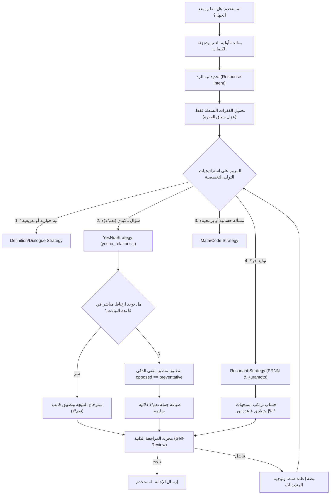

# دليل مِرنان الشامل: الهندسة الطورية والمراحل الهيكلية (Mirnan Presentation & Developer Guide)

مِرنان (Mirnan) هو محرك لغوي فيزيائي مبتكر يبتعد بالكامل عن معمارية المحولات التقليدية (Transformers) والشبكات الإحصائية ذات المليارات من المعاملات العشوائية. يقوم مِرنان على **تمثيل اللغة كحقل فيزيائي متماسك تحكمه معادلات رنين الأمواج، والجاذبية الدلالية، وجبر كليفورد، والشبكات العصبية غير الخطية (PRNN)**.

هذا الدليل مخصص لمساعدتك في شرح وتوضيح بنية مِرنان، ومراحله، وملفاته، وطريقة عمله لكل من الجمهور العام والمطورين المتخصصين.

---

## 📊 خارطة الطريق والمراحل التطويرية الـ 10 (Roadmap & Phases 0-9)

مرّ نموذج مِرنان بـ 10 مراحل هندسية متتالية للانتقال من البنية البدائية إلى نموذج إنتاجي متكامل ذي استقلالية لغوية كاملة:

| المرحلة | العنوان | الهدف والمنجز الفني |
| :--- | :--- | :--- |
| **المرحلة 0** | **التوثيق والفيزياء الطبيعية** | ضبط دلالات وعلاقات الكلمات والطور بناءً على الثوابت الطبيعية (مثل ثابت بلانك وسرعة الضوء) لتأسيس "فيزياء المعنى". |
| **المرحلة 1** | **التنظيف الشامل** | التخلص من الدالات والثوابت الميتة (غير المستخدمة) لتقليل استهلاك الذاكرة وزيادة الفعالية. |
| **المرحلة 2** | **تثبيت الأنواع الرياضية** | تثبيت كامل الأنواع الرياضية على `Float32` للمصفوفات والطور و `Int32` للمؤشرات، لمنع التحويل العشوائي ورفع أداء الحساب الطوري. |
| **المرحلة 3** | **تبسيط المولد والمحرك** | تقليص كود المولد الضخم المشتت (7220 سطر) إلى هيكل موزع مرن للغاية (55 سطر) يعتمد على استراتيجيات توليد متخصصة ومستقلة. |
| **المرحلة 4** | **هيكلة المجموعات البرمجية** | دمج 85 ملف استيراد متناثر في 10 مجموعات برمجية رئيسية (`groups/`) مرتبة بدقة حسب التبعيات لتقليل زمن الترجمة المسبقة. |
| **المرحلة 5** | **رنين كوراموتو والـ PID** | دمج رنين كوراموتو المزدوج لضبط تزامن المذبذبات اللغوية والطورية، وإدخال متحكم PID لتوجيه المولد وتجنب التكرار والقولبة. |
| **المرحلة 6** | **استرجاع RAPG الذكي** | تطوير نظام الاسترجاع المعرفي الموجه وتنشيط الذاكرة حسب فئة السؤال، وربطه بمتحكم PID لضبط الأوزان ديناميكياً. |
| **المرحلة 7** | **تعلم النفي والارتجاع** | بناء خوارزمية تحديد النفي والتناقض الدلالي، وإدخال آلية تحديث ثقة العلاقات تلقائياً بناءً على التقييم والتغذية الراجعة. |
| **المرحلة 8** | **المحرك التطوري (التطوير)** | إزالة العلامات اللغوية المسبقة الصنع والاعتماد بالكامل على نظام تعلم ذاتي متطور (`al_tawweer.jl`) يضبط الأوزان جينياً بناءً على اللياقة الحسابية. |
| **المرحلة 9** | **ستوارت-لانداو و PRNN 2.0** | إدماج الشبكة الطورية غير الخطية (PRNN 2.0) المعتمدة على معادلات ستوارت-لانداو لتطور المذبذبات، وتنفيذ آليات ربط الطور الدلالي وفكه. |

---

## 🗂️ الهيكل الشجري للملفات ووظيفة كل مكون (File Architecture)

ينقسم مشروع مِرنان إلى طبقات معمارية واضحة ومستقلة تؤدي وظائف فيزيائية ومعرفية متكاملة:

### 1. النواة الطورية والرياضية (Core Physics)
* **[constants.jl](file:///C:/Users/allmy/Desktop/aaa/basil/majnon/models/mirnan/src/physics/core/constants.jl)**: يحتوي على الثوابت الفيزيائية للطور (الأبعاد الطورية البالغة 9958 بعداً) ومقاييس التخميد والترددات.
* **[clifford_math.jl](file:///C:/Users/allmy/Desktop/aaa/basil/majnon/models/mirnan/src/physics/core/clifford_math.jl)**: ينفذ العمليات الجبرية متعددة الأبعاد (جبر كليفورد) لدمج الأحرف والكلمات وتطوير متجه الكلمة الطوري الفريد.
* **[letter_db.jl](file:///C:/Users/allmy/Desktop/aaa/basil/majnon/models/mirnan/src/physics/core/letter_db.jl)**: المعجم الفيزيائي للأحرف العربية، حيث يُعطى كل حرف 9 معاملات نطقية وصوتية تحدد موقعه الطوري.
* **[word_physics.jl](file:///C:/Users/allmy/Desktop/aaa/basil/majnon/models/mirnan/src/physics/core/word_physics.jl)**: ميكانيكا تجميع متجهات الحروف الطورية وبناء متجه الكلمة الهولوغرافي الكلي.
* **[wave_field.jl](file:///C:/Users/allmy/Desktop/aaa/basil/majnon/models/mirnan/src/physics/core/wave_field.jl)**: محاكاة تراكب وحركة الأمواج الدلالية في فضاء المتجهات.

### 2. محركات المعرفة والذاكرة الإدراكية (Cognitive Memory Modules)
* **[al_ta3rif.jl](file:///C:/Users/allmy/Desktop/aaa/basil/majnon/models/mirnan/src/physics/engines/al_ta3rif.jl)**: محرك تخزين واسترجاع التعريفات للمفاهيم بشكل نحوي دقيق وموضوعي.
* **[al_nisba.jl](file:///C:/Users/allmy/Desktop/aaa/basil/majnon/models/mirnan/src/physics/engines/al_nisba.jl)**: طبقة تدوين واستعلام العلاقات الثنائية الدلالية (مثل الاحتياج، الممانعة، الترابط السببي).
* **[al_istinbat.jl](file:///C:/Users/allmy/Desktop/aaa/basil/majnon/models/mirnan/src/physics/engines/al_istinbat.jl)**: محرك الاستدلال المنطقي ومراقبة التناقضات بين العبارات.
* **[rapg.jl](file:///C:/Users/allmy/Desktop/aaa/basil/majnon/models/mirnan/src/physics/engines/rapg.jl)**: محرك الاسترجاع المعرفي المدعم بالفيزياء (Retrieval-Augmented Physical Generation) للوصول إلى المستندات والفقرات ذات الصلة.
* **[contextual_learning.jl](file:///C:/Users/allmy/Desktop/aaa/basil/majnon/models/mirnan/src/physics/engines/contextual_learning.jl)**: استخلاص الأنماط المعرفية ديناميكياً من النصوص والكتب الملقمة.

### 3. محركات التوجيه والتحكم (Control & Resonance Engines)
* **[mirnan_cerebellum.jl](file:///C:/Users/allmy/Desktop/aaa/basil/majnon/models/mirnan/src/physics/engines/mirnan_cerebellum.jl)**: المخيخ المتحكم بنسب الذبذبات؛ يراقب الاستقرار الحركي للموجات ويعدل المعاملات عبر الارتجاع (PID Feedback).
* **[kuramoto_oscillator.jl](file:///C:/Users/allmy/Desktop/aaa/basil/majnon/models/mirnan/src/physics/engines/kuramoto_oscillator.jl)**: محاكي التزامن الطوري لكلمات السياق لتعزيز الكلمات ذات التردد المتوافق مع الطور العام.
* **[entropy_gate.jl](file:///C:/Users/allmy/Desktop/aaa/basil/majnon/models/mirnan/src/physics/engines/entropy_gate.jl)**: بوابة الإنتروبي الحرارية لكبح القولبة والتكرار في الأطوار اللفظية.
* **[potential_cascade.jl](file:///C:/Users/allmy/Desktop/aaa/basil/majnon/models/mirnan/src/physics/engines/potential_cascade.jl)**: محاكاة انحدار الجهد الدلالي (آبار الجاذبية للكلمات).
* **[self_review.jl](file:///C:/Users/allmy/Desktop/aaa/basil/majnon/models/mirnan/src/physics/engines/self_review.jl)**: محرك المراجعة الذاتية للتأكد من تماسك النص نحوياً ومنطقياً قبل إخراجه النهائي.
* **[al_tawweer.jl](file:///C:/Users/allmy/Desktop/aaa/basil/majnon/models/mirnan/src/physics/engines/al_tawweer.jl)**: المحرك الجيني التطوري الذي يولد أوزان لياقة النموذج تلقائياً ويطور الأوزان الطورية للوصول إلى أفضل تماسك.

### 4. قنوات واستراتيجيات التوليد (Generation Strategies)
تقع في المجلد `src/physics/engines/strategies/` وتعمل كطبقة تصفية وتصنيف للمدخلات لتقديم الإجابة الأكثر تخصصاً:
* **[dialogue_strategy.jl](file:///C:/Users/allmy/Desktop/aaa/basil/majnon/models/mirnan/src/physics/engines/strategies/dialogue_strategy.jl)**: تتعامل مع العبارات الحوارية اليومية والتحايا.
* **[definition_strategy.jl](file:///C:/Users/allmy/Desktop/aaa/basil/majnon/models/mirnan/src/physics/engines/strategies/definition_strategy.jl)**: تجيب على أسئلة التعاريف ("ما هو..." / "ما معنى...").
* **[relation_strategy.jl](file:///C:/Users/allmy/Desktop/aaa/basil/majnon/models/mirnan/src/physics/engines/strategies/relation_strategy.jl)**: المنسق العام للعلاقات الثنائية وأسئلة المقارنة والتضاد والاستفهام.
* **[yesno_relations.jl](file:///C:/Users/allmy/Desktop/aaa/basil/majnon/models/mirnan/src/physics/engines/strategies/yesno_relations.jl)**: محرك الإجابة بـ (نعم/لا) مع الاستدلال الذكي والتلقائي للنفي.
* **[math_strategy.jl](file:///C:/Users/allmy/Desktop/aaa/basil/majnon/models/mirnan/src/physics/engines/strategies/math_strategy.jl)**: تلتقط المسائل الحسابية وتمررها إلى [math_bridge.jl](file:///C:/Users/allmy/Desktop/aaa/basil/majnon/models/mirnan/src/physics/engines/math_bridge.jl) للحساب الرمزي والفعلي بدقة مطلقة.
* **[code_strategy.jl](file:///C:/Users/allmy/Desktop/aaa/basil/majnon/models/mirnan/src/physics/engines/strategies/code_strategy.jl)**: تلتقط طلبات البرمجة والخوارزميات وتولد كود برمجياً نظيفاً عبر [code_engine.jl](file:///C:/Users/allmy/Desktop/aaa/basil/majnon/models/mirnan/src/physics/engines/code_engine.jl).
* **[resonant_strategy.jl](file:///C:/Users/allmy/Desktop/aaa/basil/majnon/models/mirnan/src/physics/engines/strategies/resonant_strategy.jl)**: التوليد الحر المعتمد على تراكب الأمواج الطورية وقاعدة بور وتوافق كوراموتو.

---

## 🔄 مسار معالجة البيانات وتوليد الإجابة (Flow of Generation)

عندما يكتب المستخدم سؤالاً مثل: **"هل العلم يمنع الجهل؟"**، يمر هذا المدخل عبر الخطوات الفيزيائية التالية داخل مِرنان:

---

## 🎤 نقاط العرض والشرح للجمهور والمطورين (Talking Points)

عند تقديمك مِرنان للآخرين، يمكنك تقسيم العرض إلى محاور تلائم اهتماماتهم:

### 💡 للجمهور العام والمستثمرين (Why Mirnan Matters)
* **استهلاك طاقة يقارب الصفر**: بدلاً من تشغيل خوادم ضخمة بمصفوفات كروت شاشة عملاقة، يعمل مِرنان على حاسوب محمول عادي بكفاءة وسرعة فائقة لأنه لا يحتوي على معاملات بمليارات الأوزان.
* **صفر هلوسة (Zero Hallucination)**: يمتلك مِرنان ذاكرة إدراكية مهيكلة ومعزولة بدقة الفقرة؛ فهو يجيبك فقط بما يعلمه على وجه اليقين ويوثق مصدره، بدلاً من تخمين كلام يبدو صحيحاً إحصائياً.
* **اللغة كظاهرة طبيعية**: مِرنان يتعامل مع اللغة والكلمات كأمواج وجاذبيات طبيعية، مما يعطي إجابات تبدو منسابة ولها وزن دلالي متزن.

### 💻 للمطورين والمتخصصين (Technical Depth)
* **معمارية خالية من المحولات (Transformer-Free Architecture)**: التوليد يتم عبر ميكانيكا الموجات والشبكات الرنينية غير الخطية (Kuramoto & Stuart-Landau oscillators) مستخدمين قاعدة بور للترجيح اللفظي.
* **جبر كليفورد للتمثيل الهيكلي**: لا نستخدم شبكات التمثيل التقليدية الموزعة عشوائياً، بل ندمج الأحرف دلالياً وفيزيائياً في فضاء طوري متعدد الأبعاد يمنع التداخل اللغوي خاضع لمعادلات صوتية دقيقة.
* **عزل السياق الجيوديسي**: لمنع دمج المعلومات المتشابهة في كتب مختلفة، يتم عزل المعلومات وربطها بالفقرة ومصدرها الأصلي، وتفعيلها ديناميكياً فقط عند تقارب طور السؤال مع مركز الفقرة الجيوديسي.
* **التعلم الذاتي التطوري (Al-Tawweer)**: نستخدم خوارزمية جينية لتطور الأوزان ومؤشرات اللياقة التوليدية بدلاً من خوارزميات التغذية الخلفية الإحصائية (Backpropagation).
