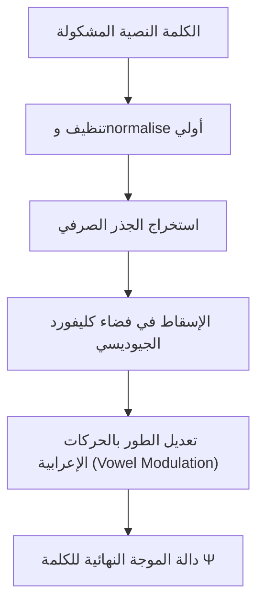

# مخطوطة الفيديو التعليمي الشامل: محرك مرنان V8 — ثورة اللسانيات الفيزيائية

مرحباً بك في هذه المخطوطة التفصيلية المخصصة لتسجيل مقطع فيديو تعليمي طويل يشرح بنية محرك **مرنان V8** الفريد من نوعه. تم إعداد هذا النص بأسلوب إلقاء تفاعلي، علمي، ومتسلسل تدرجياً ليناسب العرض المرئي والشرح على السبورة أو الشرائح التقديمية.

---

## 📽️ مقدمة الفيديو: ما وراء الإحصاء والأوزان الاتجاهية

**(المشهد: المذيع يرحب بالمشاهدين، وخلفه رسم بياني لشبكة عصبية عادية وجملة "العلم نور" مكتوبة على شكل مصفوفة دوت)**

**الحديث:**
مرحباً بكم. إذا كنت مطوراً برمجياً أو مهندساً في مجال الذكاء الاصطناعي، فأنت بالتأكيد معتاد على فكرة أن النماذج اللغوية ما هي إلا معادلات إحصائية عملاقة تقوم على التنبؤ بالكلمة التالية بناءً على مصفوفة أوزان اتجاهية ضخمة (Dense Vectors) تم تدريبها بمليارات المخرجات. 

ولكن، هل تساءلت يوماً: هل يمكننا بناء محرك يفهم اللغة والمنطق ليس كإحصاء أعمى، بل كـ **نظام فيزيائي متكامل خاضع لقوانين الجاذبية، وتداخل الأمواج، والميكانيكا الطورية؟**

اليوم سنشرح لكم بالتفصيل محرك **"مرنان V8" (Mirnan V8)**. هذا المحرك لا يعتمد على التنبؤ الإحصائي السائد، بل يمثل فضاءً معرفياً هولوغرافياً تتحرك فيه الكلمات كجسيمات فيزيائية لها كتلة، وتنشأ بينها حقول جاذبية نحوية ودلالية، وتتداخل معانيها كموجات فيزيائية حقيقية. 

دعونا نغوص في الفصول الأساسية التي تشرح فيزياء مرنان من الصفر وحتى خط أنابيب التوليد والاستنباط المتقدم.

---

## 1️⃣ الفصل الأول: فيزياء الحرف وفضاء كليفورد الهندسي

**(المشهد: الانتقال إلى السبورة الذكية لشرح التمثيل الرياضي للكلمات)**

**الحديث:**
في النماذج اللغوية التقليدية، يتم تمثيل الكلمة بنقطة ثابتة في فضاء متعدد الأبعاد (Embedding Vector). في مرنان، الكلمة هي **دالة موجية (Wavefunction) لها طور (Phase) وسعة (Amplitude)**.

### أولاً: الأثر الجذري وحساب الكتلة
تبدأ رحلة الكلمة من بنيتها الصرفية. لكل كلمة في مرنان كتلة فيزيائية (Mass) تعتمد على تكرارها ودورها النحوي، ويتم ضبط ترددها وحساب "الأثر الجذري" لها. 

### ثانياً: فضاء كليفورد والتردد التوافقي
بدلاً من المتوسط الخطي للمتجهات، يستخدم مرنان **جداء كليفورد الهندسي (Clifford Geometric Product)** لدمج السياق. هذا الفضاء متعدد الأبعاد يسمح بتمثيل الحركات اللغوية (الفتحة والضمة والكسرة) كتعديلات طورية ديناميكية:
* **تعديل الحركات (Vowel Modulation)**: تؤخذ الحركات الإعرابية كإزاحات دورانية لنصف قيمة حرف المد المقابل.
* **الحفاظ على التشكيل**: الحركات الإعرابية (مثل العلمُ، العلمَ، العلمِ) لا تُحذف؛ بل تغير طور الكلمة لتشير إلى دورها الفيزيائي (فاعل، مفعول، مجرور) في فضاء الحركة النحوية.



---

## 2️⃣ الفصل الثاني: محركات الذاكرة المعرفية الأربعة

**(المشهد: شرح المجلد المعرفي `knowledge/` وكيف تندمج البيانات)**

**الحديث:**
مرنان ليس مجرد مولد نصوص؛ بل هو عقل ترابطي يحتوي على أربع ذاكرات معرفية تعمل بالتوازي كحقول جذب مغناطيسية:

```
                  ┌───────────────────────────────┐
                  │      الذاكرة المعرفية لمرنان   │
                  └──────────────┬────────────────┘
                                 │
         ┌──────────────┬────────┴─────┬──────────────┐
         ▼              ▼              ▼              ▼
   ┌───────────┐  ┌───────────┐  ┌───────────┐  ┌───────────┐
   │ al_ta3rif │  │ al_nisba  │  │al_istinbat│  │al_muradif │
   │ (التعريفات)│  │ (العلاقات)│  │ (الاستنباط)│  │ (المترادفات)│
   └───────────┘  └───────────┘  └───────────┘  └───────────┘
```

1. **التعريفات (`al_ta3rif`)**:
   تخزن تعريفات المفاهيم (مثل: *ما هو العلم؟*). لا يتم البحث عنها كأجوبة نصية مخزنة، بل يتم إسقاط الاستعلام دلالياً على فضاء التعريفات ليتحرك المتجه نحو نواة المفهوم المعرف في الجداول.
2. **العلاقات (`al_nisba`)**:
   تقوم برسم خطوط الجذب والمنع والتحول بين المفاهيم. مثلاً:
   * الرحمة تهذب القوة (علاقة تهذيب ومنع قسوة).
   * الجهل يقود إلى الظلم (علاقة دفع سببي).
3. **الانتباه الاستنباطي (`al_istinbat`)**:
   ذاكرة منطقية عميقة تراقب الترابط السببي والتناقض والشرط. هي المسؤول الأول عن تحديد ما إذا كان مفهوم أ يمنع أو يسبب ب.
4. **المكافئ الدلالي (`al_muradif`)**:
   حقل التمدد الدلالي المعتمد على التشابه الطيفي الجيبي. إذا استخدمت كلمة *"الإنصاف"*، يقوم هذا المحرك بجذب كلمة *"العدل"* تلقائياً لتقريب فجوة الإشارات في فضاء كليفورد.

---

## 3️⃣ الفصل الثالث: قوانين الحركة والجاذبية في التوليد (Resonant Generation)

**(المشهد: المذيع يعرض الكود البرمجي لمصفوفات التحويل والنحو ويشرح الحركة الفيزيائية)**

**الحديث:**
ماذا يحدث عندما تطرح سؤالاً على مرنان ولا يجد إجابة جاهزة في الجداول المعرفية؟ 
هنا يبدأ ما يسمى **"التوليد بالرنين الفيزيائي" (`_resonant_generate`)**.

يتم حساب طاقة التنشيط لكل كلمة في المعجم لتحديد الكلمة التالية بناءً على تراكب 3 قوى فيزيائية رئيسية:

### أوزان التسجيل الفيزيائية (Scoring Waves):
\[
\Psi_{\text{total}} = A_{\text{align}} \cdot e^{i\theta_{\text{align}}} + A_{\text{gravity}} \cdot e^{i\theta_{\text{gravity}}} + A_{\text{syntax}} \cdot e^{i\theta_{\text{syntax}}}
\]

1. **الجاذبية الدلالية الدورية (`K_sem * phase`)**:
   حقل جذب يشد التوليد نحو الكلمات التي ترتبط دلالياً بموضوع السؤال الإجمالي.
2. **التناقل النحوي الموضعي (`gen.K_syn[prev_id, :]`)**:
   وهذه واحدة من أهم قفزات مرنان V8. بدلاً من خلط النحو الإجمالي، ينظر المحرك إلى الكلمة **المولدة الأخيرة فوراً** (`prev_id`) ويسحب فقط الصف النحوي الخاص بها من مصفوفة الانتقال النحوي. هذا يضمن تدفق الكلمات نحواً وإعراباً بسلاسة فائقة (مثل أن يأتي بعد حرف الجر اسم مجرور، وبعد الفعل فاعل).
3. **التدفق السببي الموجي المعكوس (`gen.K_causal' * phase`)**:
   يتم ضرب منقول مصفوفة السببية للتأكد من أن التدفق يسير إلى الأمام (من السبب إلى النتيجة) وليس بشكل تراجعي معكوس.

---

## 4️⃣ الفصل الرابع: عزل الفقرات دلالياً وبوابة الإنتروبيا

**(المشهد: رسم توضيحي لكوربس مقسم لفقرات وكل فقرة لها مركز ثقل)**

**الحديث:**
تخيل أنك تدرس نموذجاً عن موضوعين مختلفين يحتويان على كلمات مشتركة؛ مثلاً: فقرة تتحدث عن *"العدل في المحاكم وعلاقته بالقضاء"*، وفقرة تتحدث عن *"العدل والرحمة في تربية الأطفال"*. 
في النماذج العادية، قد تتداخل المعارف وتحدث هلوسة تخلط بين المحاكم وتربية الأطفال. 

حل مرنان V8 هذه المشكلة عبر **Contextual Paragraph Isolation (عزل السياق الفقري)**:

```
              [الاستعلام: ما رأيك في القضاء؟]
                             │
                             ▼ (حساب متجه الاستعلام)
         ┌───────────────────┴───────────────────┐
         ▼                                       ▼
  (مركز ثقل الفقرة 1: القضاء والعدل)      (مركز ثقل الفقرة 2: الأسرة والتربية)
  التشابه الطوري: 0.89                   التشابه الطوري: 0.21
  [حالة الفقرة: نشطة ✓]                  [حالة الفقرة: خاملة ✗]
         │
         ▼
  (Retrieved ONLY from Paragraph 1)
```

1. **حساب مراكز ثقل الفقرات (Paragraph Centroids)**:
   أثناء التدريب، يتم حساب متجه متوسط الجاذبية لكل فقرة على حدة ويحفظ في ملف `paragraph_centroids.json`.
2. **عتبة التنشيط والاضمحلال الطوري**:
   عند طرح السؤال، يتم حساب جيب تمام الزاوية (Cosine Similarity) بين متجه السؤال ومراكز الفقرات. يتم تنشيط الفقرات التي تتجاوز عتبة التوافق (مثال: `> 0.45`) ويتم تصفية وتخفيض درجات العلاقات والتعريفات القادمة من الفقرات الخاملة. 
3. **بوابة الإنتروبيا (Entropy Gate)**:
   بوابة فيزيائية تقيس مدى تشتت دالة الاحتمال أثناء التوليد. إذا ارتفعت الإنتروبيا وتجاوزت العتبة الحرجة (`S_crit = 1.0`)، تتدخل البوابة لخفض درجة الفوضى الطورية وضبط مسار التدفق التوليدي لمنع خروج كلمات عشوائية.

---

## 5️⃣ الفصل الخامس: التقييم العملي ومقاومة الخداع والنفي

**(المشهد: عرض مقارنات الأسئلة من مسبار التقييم المباشر على الشاشة)**

**الحديث:**
دعونا نرى كيف ينعكس هذا التصميم رياضياً عند اختبار النموذج بأسئلة مسبار التعميم والخداع:

### أولاً: كشف الخداع الاتجاهي (Directional Deception)
عند طرح سؤال معكوس مثل: *"لماذا يزيد الفهم العلم؟"*، يتدخل **حارس الاتجاه التفسيري (`_explanatory_direction_guard_answer`)** ليقوم بالآتي:
* يحول السؤال ذهنياً إلى استعلام تأكيدي: *"هل الفهم يزيد العلم؟"*.
* يقارن الاتجاه الدلالي المكتشف مع علاقات الذاكرة، فيكتشف أن الاتجاه الحقيقي الصحيح والمخزن هو: *"العلم هو الذي يزيد الفهم"*.
* فيستدعي فوراً مؤثر النفي ويجيب بحسم: `"لا، الفهم لا يزيد العلم."`

### ثانياً: الفروقات والتمييز الدقيق
عند السؤال عن الفرق: *"ما الفرق بين العلم والجهل؟"*، يقوم محرك عزل الفقرات بفصل معنيين متناقضين في فضاء الموجة وإعطاء إجابة مدمجة ممتازة:
`"العلم: وجمع المعرفة التي تكشف الخفاء. أما الجهل: غياب العلم بما يحجب الفهم ويزيد الخطأ."`

---

## 💡 التوصيات المعمارية للمطورين والباحثين

**(المشهد: المذيع في لقطة مقربة يقدم النصائح البرمجية لتطوير مرنان مستقبلاً)**

**الحديث:**
لكل من يريد بناء أو تطوير محرك فيزيائي مثل مرنان، إليكم أهم التوصيات البرمجية والمعمارية المستخلصة من تجارب V8:

1. **تجنب القوالب اليدوية الصارمة**:
   حاول دائماً إضعاف دور التعبيرات النمطية والكلمات اليدوية (Hardcoded Keywords) واستبدالها بحسابات **المسافة الجيوديسية** للتنافر والجاذبية، لكي لا يفقد المحرك مرونته مع تغير المواضيع التدريبية.
2. **علاج مشكلة عدم التماثل الاتجاهي (The Asymmetry Bug)**:
   رصدنا في مسبار التعميم أن المحرك ينفي أحياناً علاقة صحيحة (مثل: *العدل يحفظ السلام*) لمجرد أنه وجد علاقة معكوسة صحيحة أيضاً (مثل: *السلام ينتج عن العدل*). 
   الحل هو عدم نفي الاتجاه المباشر تلقائياً إلا إذا كان الاتجاه المعكوس يمثل **تناقضاً صريحاً** أو قطبية سالبة في سجلات الذاكرة المعرفية.
3. **طبقة المطابقة الفيزيائية المرنة للتشكيل**:
   لكي لا يعامل المحرك الكلمات المشكولة ككلمات غريبة تماماً (OOV)، يجب وضع مؤثر إسقاط طوري (Phase Projection Operator) يقوم بمطابقة الكلمتين (العِلْم والعلمُ) تحت جذر مشترك مع الاحتفاظ بالحركات اللغوية في مصفوفة النحو فقط لتوجيه مخارج الصياغة.

---

## 🎬 خاتمة الفيديو

**الحديث:**
مرنان V8 يثبت لنا أن معالجة اللغة الطبيعية يمكن أن تخرج عن عباءة النماذج الإحصائية التقليدية والوزن الأعمى للأرقام، لتدخل في فضاء المحاكاة الفيزيائية الرنينية. اللغة موجة، والمنطق جاذبية، والمعرفة فضاء متكامل من تداخل الأطوار.

شكراً لمتابعتكم، وإلى اللقاء في شرح معمق آخر لفيزياء الذكاء الاصطناعي!

**(المشهد: شاشة ختامية مع روابط للمستندات البرمجية للمحرك)**
