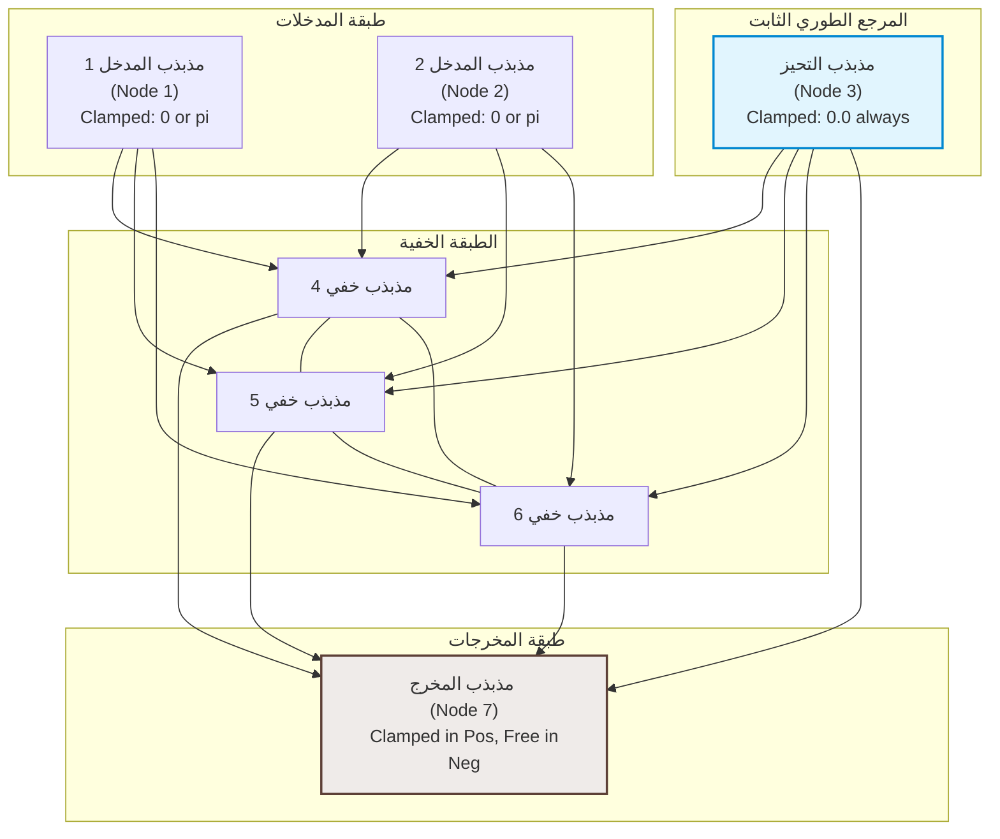

# 🧠 تقرير تحليل الشبكة العصبية الرنينية الطورية (Phase-Resonant Neural Network - PRNN)

يمثل مشروع **مرنان (Mirnan)** والشبكة العصبية الرنينية الطورية (PRNN) نموذجاً ريادياً وبديلًا فيزيائياً متكاملاً للحوسبة الرقمية والشبكات العصبية الكلاسيكية. بدلاً من معالجة الأرقام كقيم جافة والتحديث عبر خوارزمية الانتشار العكسي (Backpropagation) المكلفة، تعتمد PRNN على ديناميكا التداخل الموجي والتزامن الذاتي بين المذبذبات الفيزيائية المستمرة.

يوفر هذا التقرير تحليلاً رياضياً وهندسياً وبنيوياً للنماذج التجريبية المتوفرة في المجلد `prnn_toy` لغرض فهم المفهوم وآلية عمله بالكامل.

---

## 🏛️ 1. الفلسفة الأساسية ونقلة البارادايم

في الحوسبة العصبية الكلاسيكية، يُمثل العصبون بمتغير حقيقي ثابت $x \in \mathbb{R}$، والتأثير البيني بين العصبونات هو عملية ضرب رقمية. أما في **PRNN**:
* **العصبون كدالة موجية (Wave Function):** كل عصبون يُمثل بمذبذب طوري في الفضاء المركب $z_i(t) = r_i(t) e^{j\phi_i(t)}$. الطور $\phi_i$ يُمثل السياق أو المفهوم اللحظي، بينما تمثل السعة $r_i$ طاقة الفكرة أو مستوى الثقة (Attention/Confidence).
* **الوزن كموصل رنيني (Resonant Coupling):** يُمثل معامل الاقتران $K_{ij}$ قوة التوصيل الفيزيائي وإزاحة الطور الهندسية بين موجتين.
* **التنشيط كـتداخل موجي طبيعي (Wave Interference):** بدلاً من دوال التنشيط الحسابية (مثل ReLU أو Sigmoid)، يحدث التنشيط طبيعياً بالفيزياء:
  * **تداخل بنّاء (Constructive):** عند تطابق الأطوار، تتقوى الموجات وترتفع السعة.
  * **تداخل هدّام (Destructive):** عند تعارض الأطوار، تلغي الموجات بعضها ديناميكياً وتنخفض السعة تلقائياً إلى الصفر (**Dynamic Gating**).
* **التعلم كـتزامن ذاتي (Self-Synchronization):** تتدرب الشبكة محلياً باتباع مبدأ هويجنز للتزامن الذاتي عبر التعلم الهيبي التبايني (CHL) دون الحاجة لمشتقات أو حسابات معقدة لكامل الشبكة.

---

## 🧬 2. المعادلات الرياضية الأساسية

### أ. نموذج كوراموتو (Kuramoto Model) - أطوار فقط
يُحاكي سلوك المذبذبات ذات السعة الثابتة والموحدة، حيث يتغير الطور فقط وفقاً لمعادلة كوراموتو:
$$ \frac{d\phi_i}{dt} = \omega_i + \sum_{j=1}^N K_{ij} \sin(\phi_j - \phi_i) + \eta_i(t) $$
* $\omega_i$: التردد الطبيعي الذاتي للمذبذب $i$ (يكسر التناظر الهيكلي).
* $K_{ij}$: قوة الاقتران بين المذبذب $i$ و $j$.
* $\eta_i(t)$: ضوضاء لانجفان الحرارية (Langevin Thermal Noise) لتجنب النهايات الصغرى المحلية.

### ب. نموذج ستوارت-لانداو (Stuart-Landau Model) - سعة وطور
يمثل المحرك المطور ثنائي الأبعاد في الفضاء المركب $z \in \mathbb{C}$ لتضمين متغير الثقة (السعة):
$$ \frac{dz_i}{dt} = (\mu - |z_i|^2 + j\omega_i) z_i + \sum_{j=1}^N K_{ij} (z_j - z_i) + \eta_i(t) $$
* $\mu$: حد النمو الطبيعي للسعة (يجذب السعات للاستقرار عند $\sqrt{\mu}$).
* $-|z_i|^2 z_i$: حد التشبع اللاخطي لمنع تضخم السعة.
* $K_{ij} (z_j - z_i)$: الاقتران الانتشاري (Diffusive Coupling) الذي يسحب العصبونات نحو التزامن الموجي.

---

## ⚓ 3. معضلة التناظر الطوري (Phase Symmetry Trap) وحلها

عند محاولة حل معضلة **XOR** الطورية ثنائية الأبعاد، تظهر عقبة فيزيائية:
إذا مثلنا القيم المنطقية كأطوار:
* القيمة **0** $\rightarrow$ طور $0.0$ راديان.
* القيمة **1** $\rightarrow$ طور $\pi$ راديان.

تعتمد معادلة التفاعل والاقتران حصرياً على **فرق الطور الجيبي** $\sin(\phi_j - \phi_i)$، مما يجعل النظام متناظراً تماماً ضد أي إزاحة دورانية موحدة $\theta$ لجميع الأطوار.
* الانتقال من الإدخال $(0,0)$ ذو الأطوار $[0, 0]$ إلى الإدخال $(1,1)$ ذو الأطوار $[\pi, \pi]$ يمثل إزاحة طورية جماعية بمقدار $\pi$. 
* بسبب تناظر النظام، فإن المخرج للمدخل $(1,1)$ سيتحول حتماً وبشكل متناظر إلى $\phi_{\text{out}} + \pi$.
* بما أن XOR تقتضي أن يكون مخرج $(0,0)$ ومخرج $(1,1)$ متطابقين (كلاهما 0)، بينما مخرج $(1,0)$ و $(0,1)$ يساوي $\pi$، فإن التناظر الدوراني يحول دون إمكانية حل المعضلة.

### الحل المبتكر: مذبذب التحيز المرجعي (Reference Bias Node)
تم إدخال مذبذب مرجعي (العقدة 3) مثبت دائماً عند الطور $0.0$ راديان (Phase Ground) في جميع مراحل التدريب والاختبار.
يعمل هذا المذبذب المرجعي كمرساة تكسر التناظر الدوراني المطلق للشبكة، مما يسمح للخلايا الخفية بمقارنة اتساق أطوار المدخلات نسبةً إلى مرجع ثابت، وهو ما يمكّنها من تمثيل وحل العلاقات اللاخطية بنجاح بنسبة 100%.



---

## 🛠️ 4. آلية التعلم التبايني الهيبي (Contrastive Hebbian Learning - CHL)

يتم تدريب الأوزان $K_{ij}$ محلياً عبر مرحلتين لكل عينة:
1. **المرحلة الموجبة (+ Positive Phase):** يتم قفل أطوار المدخلات والمخرج عند الأطوار المستهدفة (الصحيحة) وتثبيت التحيز عند $0.0$. تترك الخلايا الخفية لتستقر وتتزامن تحت هذا القيد. نسجل الأطوار النهائية المستقرة كـ $\phi_i^+$.
2. **المرحلة السالبة (- Negative Phase):** تترك المدخلات والتحيز مقفلة، ولكن **يتم تحرير المخرج** ليتحرك بحرية تاماً بناءً على قوى التزامن الداخلي للشبكة. تسجل الأطوار النهائية المستقرة كـ $\phi_i^-$.
3. **تحديث الأوزان محلياً (Hebbian Update):**
   * **لنموذج الطور فقط:**
     $$ \Delta K_{ij} = \eta \left( \cos(\phi_i^+ - \phi_j^+) - \cos(\phi_i^- - \phi_j^-) \right) $$
   * **لنموذج ستوارت-لانداو (المركب):**
     $$ \Delta K_{ij} = \eta \left( \text{Re}(z_i^+ z_j^{+*}) - \text{Re}(z_i^- z_j^{-*}) \right) = \eta \left( r_i^+ r_j^+ \cos(\phi_i^+ - \phi_j^+) - r_i^- r_j^- \cos(\phi_i^- - \phi_j^-) \right) $$
     حيث يتعاظم التحديث عندما تتزامن الخلايا في الحالة الموجبة وتتباعد في الحالة الحرة، ويضمحل التحديث تلقائياً إذا انخفضت سعة إحدى العقدتين (آلية الانتباه).

---

## 📂 5. تحليل ملفات المشروع والتطبيقات المبتكرة

يضم المجلد مجموعة غنية جداً من التطبيقات التي تثبت هذه المفاهيم تدريجياً:

### 1️⃣ حل بوابة XOR الأساسي والمطور
* **[prnn_toy.jl](file:///C:/Users/allmy/Desktop/aaa/basil/majnon/models/mirnan/prnn_toy/prnn_toy.jl):** يحل XOR بنموذج كوراموتو الطوري (7 عصبونات). يتقارب الخطأ بسرعة ليصل إلى أقل من **0.08 راديان** وبدقة **100%**.
* **[prnn_stuart_landau.jl](file:///C:/Users/allmy/Desktop/aaa/basil/majnon/models/mirnan/prnn_toy/prnn_stuart_landau.jl):** يحل XOR باستخدام مذبذبات ستوارت-لانداو المركبة مع ميزة **جدولة الضوضاء والتبريد (Simulated Annealing)** لضمان الاستقرار التام للسعة والطور، محققاً دقة **100%**.

### 2️⃣ الذاكرة الترابطية وإكمال الأنماط (Pattern Completion)
* **[prnn_associative_memory.jl](file:///C:/Users/allmy/Desktop/aaa/basil/majnon/models/mirnan/prnn_toy/prnn_associative_memory.jl):** محاكاة ذاكرة هوبفيلد موجية لـ 8 مذبذبات مركبة. يتم تخزين نمطين طوريين متعامدين في مصفوفة الاقتران $K$.
* عند تقديم نمط مشوه للغاية أو مفقود السعات والأطوار (عناصر تساوي صفراً)، تتطور معادلات ستوارت-لانداو ديناميكياً لتسحب النظام إلى أقرب **حوض جذب طوري (Phase Attractor Basin)** وتعيد بناء النمط المشوه بنسبة نجاح **100%**.

### 3️⃣ الذاكرة المتسلسلة والدورات الحدية (Limit Cycles)
* **[prnn_sequential_memory.jl](file:///C:/Users/allmy/Desktop/aaa/basil/majnon/models/mirnan/prnn_toy/prnn_sequential_memory.jl):** للانتقال من الاسترجاع الساكن إلى التوليد التلقائي المتسلسل للأنماط ($A \rightarrow B \rightarrow C \rightarrow A$)، تم دمج ثلاث آليات فيزيائية:
  1. **كسر تناظر الزمن (Time-Reversal Symmetry Breaking):** صياغة مصفوفة اقتران غير متماثلة $K_{ij} \neq K_{ji}$ هيبية الحركة.
  2. **التثبيط العالمي التنافسي (Global Competitive Inhibition):** يمنع نشاط أكثر من نمط واحد في نفس اللحظة عبر إخماد الطاقة المشتركة.
  3. **التعب العصبي المحلي (Local Synaptic Adaptation/Fatigue):** متغير بطيء $a_i(t)$ يثبط العصبون تدريجياً بعد فترة من نشاطه ليفسح المجال للنمط التالي.
* تنتقل الشبكة بنجاح في حركة دورية لا نهائية عبر أحواض الجذب.

### 4️⃣ مولد النصوص الهولوغرافي وتجنب تسرب الاقتران
* **[prnn_text_generator.jl](file:///C:/Users/allmy/Desktop/aaa/basil/majnon/models/mirnan/prnn_toy/prnn_text_generator.jl):** يواجه توليد الجمل مشكلة التفرع في الكلمات المشتركة (مثال: حرف العطف "و"):
  * الجملة 1: "العلم" $\rightarrow$ "نور" $\rightarrow$ **"و"** $\rightarrow$ "الجهل" $\rightarrow$ "ظلام"
  * الجملة 2: "الحياة" $\rightarrow$ "جميلة" $\rightarrow$ **"و"** $\rightarrow$ "العقل" $\rightarrow$ "زينة" $\rightarrow$ "الإنسان"
* بدون سياق تاريخي، سيحدث تسرب اقتراني عند كلمة "و" وتولد الشبكة مسارات عشوائية متداخلة.
* **الحل بالربط الهولوغرافي الطوري (Holographic Phase Binding):** مستوحى من أنظمة الرموز المتجهة (VSA)، يتم دمج الكلمة الحالية بالسابقة بضرب نقطي مركزي (Element-wise multiplication):
  $$ \tilde{v}_{w_t} = v_{\text{base}}(w_t) \odot v_{\text{base}}(w_{t-1}) $$
  هذا الضرب الطوري ينتج متجهات متعامدة تماماً لـ "الكلمة في سياقها". عند الاسترجاع، يتم فك الربط بالضرب في مرافق الكلمة السابقة:
  $$ z_{\text{unbound}} = z_{\text{state}} \odot v_{\text{context}}^* $$
  ينجح النموذج بنسبة **100%** في سلك المسارات السياقية الصحيحة بناءً على Prompt البدء.

### 5️⃣ التعلم من كوربوس نصوص حقيقي بأبعاد فائقة
* **[prnn_corpus_learner.jl](file:///C:/Users/allmy/Desktop/aaa/basil/majnon/models/mirnan/prnn_toy/prnn_corpus_learner.jl):** يرفع الأبعاد إلى **10,000 بُعد** طوري مستمد مباشرة من أوزان لغة مرنان الحقيقية.
* لحل مشكلة التعقيد الحسابي المتزايد $O(N^2)$ عند هذه الأبعاد، يطبق الكود **محاكاة منخفضة الرتبة سريعة O(T * N)** تعتمد على الضرب النقطي المتجهي لحساب قوى التزامن السببي بدلاً من بناء وحفظ مصفوفة أوزان كاملة.

### 6️⃣ المحاكاة الكمية التناظرية
* **[prnn_quantum_wave.jl](file:///C:/Users/allmy/Desktop/aaa/basil/majnon/models/mirnan/prnn_toy/prnn_quantum_wave.jl):** محاكاة مبتكرة للمفاهيم الكمية بوسط كلاسيكي مقترن انتشاريًا:
  * **تجربة الشق المزدوج:** حقن موجات بأطوار مختلفة عند شقين وملاحظة أهداب التداخل والعقد المدمرة (Destructive nodes).
  * **الإفناء الموجي (Wave Annihilation):** تمثيل بوابة NOT بضرب الموجة في $-1$ (إزاحة طورية بـ $\pi$) ومراقبة تلاشي سعة الحقل بالكامل.
  * **التشابك والانهيار (Phase Collapse):** مذبذبان متشابكان بطور متضاد حران تحت ضوضاء حرارية، عند قياس (Clamp) أحدهما ينهار الآخر لحظياً ومباشرة للطور المقابل المعاكس.

### 7️⃣ مقارنة الأداء (Coherence Benchmark)
* **[benchmark_prnn_vs_ngram.jl](file:///C:/Users/allmy/Desktop/aaa/basil/majnon/models/mirnan/prnn_toy/benchmark_prnn_vs_ngram.jl):** يقارن أداء الـ PRNN ضد نموذج Bigram إحصائي كلاسيكي.
* يظهر البنشمارك تفوق PRNN في إنتاج مسارات دلالية عالية التماسك والاتساق ومنع التكرار اللفظي ديناميكياً من خلال التعب التنافسي، بالرغم من استهلاكها طاقة حسابية ومساحة ذاكرة أكبر نتيجة المحاكاة الفيزيائية المستمرة للموجات في أبعاد فائقة.

---

## ⚡ 6. الدائرة الإلكترونية التناظرية لـ XOR بالتزامن الطوري

يحتوي الملف **[prnn_xor_7osc.cir](file:///C:/Users/allmy/Desktop/aaa/basil/majnon/models/mirnan/prnn_toy/prnn_xor_7osc.cir)** على تصميم دائرة إلكترونية تناظرية كاملة (SPICE Netlist) تمثل تجسيداً مادياً لشبكة XOR الطورية.

### المكونات والآلية:
* **المذبذب غير الخطي:** يتم تمثيل كل مذبذب في الدائرة بـ **مذبذب فان دير بول (Van der Pol Oscillator Subcircuit)** المكون من دائرة رنين LC عند تردد 1 kHz مع مقاومة سالبة غير خطية للتشبع وسعة تذبذب ثابتة:
  $$ I = 0.002 V - 0.0001 V^3 $$
* **الحقن وقفل الطور:** يتم حقن الإشارات الخارجية في المداخل (عبر مصادر جهد جيبي `VIN1` و `VIN2` و `VIN3`) لقفل أطوارها عند $0$ أو $\pi$ (180 درجة).
* **برمجة الأوزان عبر الـ VCCS:** يتم تمثيل أوزان الاقتران $K_{ij}$ باستخدام مصادر تيار متحكم بها بالجهد (Voltage Controlled Current Sources - G-elements) تحاكي بدقة الاقتران الانتشاري:
  $$ I(\text{NODE}_i) = K_{ij} \times (V(\text{NODE}_j) - V(\text{NODE}_i)) $$
* **سلوك الدائرة:** عند تشغيل المحاكاة العابرة (`.TRAN`) لـ 15 ملي ثانية، يستقر المخرج الحر عند العقدة 7 في الطور المتوافق تماماً مع جدول XOR المنطقي بناءً على الرنين الفيزيائي البحت.

---

## 🚗 7. تطبيق الويب التفاعلي: لعبة السيارة ذاتية التعلم (Smart Car Game)

تقع محاكاة المتصفح التفاعلية في مجلد **[prnn_car_game](file:///C:/Users/allmy/Desktop/aaa/basil/majnon/models/mirnan/prnn_toy/prnn_car_game/)** وتعمل مباشرة بمجرد تشغيل `index.html`.

### هندسة الشبكة التفاعلية (8 مذبذبات):
* **عقد الإدخال (0، 1، 2):** مستشعرات المسافة الليزرية الثلاثة (يسار، أمام، يمين). يقفل طور كل منها بين $0.0$ راديان (طريق آمن) و $\pi$ راديان (عائق شديد القرب).
* **عقدة التحيز (3):** مثبتة عند الطور $0.0$ دائماً كمرجع طوري.
* **عقد خفية (4، 5، 6):** معالجة وبناء التمثيلات الفراغية واللاخطية.
* **عقدة التوجيه (7):** يتحكم طورها بزاوية عجلة القيادة:
  $$ \text{Steer Angle} \propto \sin(\phi_7 - \phi_3) $$

```
                                 [السيارة الذكية]
                                  /      |      \
                            يسار (0)   أمام (1)  يمين (2)    مرجع التحيز (3) [0.0]
                              \          |         /          /
                               \         |        /          /
                                [مذبذبات الطبقة الخفية (4، 5، 6)]
                                          \      /
                                           \    /
                                     مخرج التوجيه (7)
                                   (sin(phi_7 - phi_3))
```

### آليات التعلم المطبقة في الوقت الحقيقي داخل المتصفح:
1. **التعلم التبايني عند الخطر (Danger-Triggered CHL):** إذا اقتربت السيارة جداً من الجدران (خطر حرج < 0.4)، يسجل المحرك حالة الأطوار الحرة الخاطئة ($\phi^-$)، ثم يقفل المخرج قسرياً في الاتجاه المعاكس الآمن للابتعاد ويشغل المحاكاة لتستقر الأطوار الخفية لتسجيل الحالة المقيدة المقبولة ($\phi^+$). بعد ذلك، يطبق قانون CHL لتحديث مصفوفة الاقتران.
2. **التعلم المعزز الهيبي (Reward-Modulated Hebbian RL):** تحديث مستمر للأوزان:
   $$ \Delta K_{ij} = \eta \cdot \text{Reward} \cdot \cos(\phi_i - \phi_j) $$
   حيث تكون المكافأة موجبة للسير المستقيم السريع، وسالبة حادة عند الاقتراب أو الاصطدام.
3. **التوجيه اليدوي للتعليم (Imitation Learning):** يمكن للمستخدم قيادة السيارة يدوياً بواسطة الأسهم وتقوم الشبكة بالتقاط أسلوبه وتخزين حركات الانعطاف الآمنة في مصفوفة الاقتران مباشرة هيبياً.

---

## 🎯 8. الخلاصة والاستنتاجات البنيوية

تثبت هذه المراجعة الشاملة لشبكة **PRNN** المبتكرة ما يلي:
1. **الاستغناء الكامل عن الانتشار العكسي (Backpropagation-Free):** يمكن بناء تمثيلات لاخطية معقدة وحل مشاكل تصنيف وتحكم وتوليد نصوص بالكامل عبر قوانين فيزيائية محلية وتزامن تلقائي.
2. **الكفاءة الفيزيائية:** النماذج قابلة للتحويل المباشر إلى بوابات إلكترونية تناظرية صلبة وسريعة جداً (كما في نموذج SPICE)، مما يمهد لعصر جديد من شرائح الذكاء الاصطناعي منخفضة استهلاك الطاقة القائمة على الحوسبة الموجية والرنين التناظري.
3. **الربط الهولوغرافي لحل السياق:** يعالج هذا المفهوم بذكاء عقبة "الذاكرة قصيرة المدى وتفرع القنوات اللغوية" دون الحاجة لطبقات Attention أو فضاءات تخزين ضخمة.
